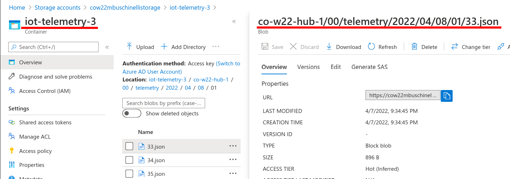

# Blog Storage 

## Storage Accounts

As one can imagine, there are many types of storage accounts in Azure. In this course we'll explored **Blob Storage** (object storage).

> To know more about the other storage services offered by Azure see **[Introduction to Azure Storage](https://docs.microsoft.com/en-us/azure/storage/common/storage-introduction#main)**.

## Blob Storage

Azure Blob storage is an object storage solution optimized for storing massive amounts of text or binary data.

Blob storage is designed for:

-   Serving images or documents directly to a browser.
-   Storing files for distributed access.
-   Streaming video and audio.
-   Writing to log files.
-   Storing data for backup and restore, disaster recovery, and archiving.
-   Storing data for analysis by an on-premises or Azure-hosted service.

### Storage Structure

Blob storage has the following structure:

- **Storage account**: provides a unique address that includes your account name.

- **Containers:** organizes a set of blobs, similar to a directory in a file system.

- **Blobs:** the file being stored.

    <a href="https://docs.microsoft.com/en-us/azure/storage/blobs/storage-blobs-introduction"> Structure of Blob storage </a>&nbsp; Introduction to Azure Blob storage.

### Creating a Storage Account & Container

> For details on how to create a storage account see **[Create a storage account](https://docs.microsoft.com/en-us/azure/storage/common/storage-account-create?toc=%2Fazure%2Fstorage%2Fblobs%2Ftoc.json&tabs=azure-portal)**.

The default setting for creating a Storage Account and Blob Container are sufficient for this course.

However, if you would like your containers to have sub-folders, see the next section.

#### Hierarchical Directories & Data Lake Storage

By default, Blob storage has a flat file structure. This means that all blobs (files) sit at the same level inside the **container**.

Azure Data Lake Storage Gen2 is built on top of Blob storage, but offers additional features designed for big data analytics.

In particular, it offers hierarchical directory organisation at a marginal price increase.

> This simplifies storage retrieval and organisation so it will be the **preferred storage** option for IoT telemetry data.
>
> For more information see [**Introduction to Azure Data Lake Storage Gen2**](https://docs.microsoft.com/en-us/azure/storage/blobs/data-lake-storage-introduction).

Note: A Blob storage container is the Azure equivalent of an [Amazon S3 bucket](https://docs.aws.amazon.com/AmazonS3/latest/userguide/GetStartedWithS3.html).

## Blob Storage SDKs

As usual, Azure provides a SDK to interact with blob storage.

#### Python SDK
> Python SDK **[documentation overview](https://docs.microsoft.com/en-us/python/api/overview/azure/storage-blob-readme?view=azure-python)** for:
>- Getting started.
>- Key concepts.
>- Examples.

**Quick Links**
[Package (PyPI)](https://pypi.org/project/azure-storage-blob/) | [API reference documentation](https://aka.ms/azsdk-python-storage-blob-ref) | [Product documentation](https://docs.microsoft.com/en-us/azure/storage/) | [Samples](https://github.com/Azure/azure-sdk-for-python/tree/azure-storage-blob_12.11.0/sdk/storage/azure-storage-blob/samples)

#### .NET SDK
> .NET SDK **[documentation overview](https://docs.microsoft.com/en-us/dotnet/api/overview/azure/storage.files.datalake-readme?view=azure-dotnet)** for:
>- Getting started.
>- Key concepts.
>- Examples.

**Quick Links**
[Package (NuGet)](https://www.nuget.org/packages/Azure.Storage.Files.DataLake/) | [API reference documentation](https://docs.microsoft.com/en-us/dotnet/api/azure.storage.files.datalake) | [REST API documentation](https://docs.microsoft.com/en-us/rest/api/storageservices/datalakestoragegen2/filesystem) | [Product documentation](https://docs.microsoft.com/en-us/azure/storage/blobs/?toc=/azure/storage/blobs/toc.json)

#### Notes on Blob Storage SDKs:

- **Blob name** is usually the path to the blob object relative to the container.
	- In the image below we have the container name on the left and the blob name on the right.

## Blog Storage & Event Hubs

When ingesting EventHub events using the Nuget package `Azure.Messaging.EventHubs`, you might require a [`BlogContainerClient`](& Message Routing).

To create an instance of a  `BlobContainerClient` , you must provide the following information:

1. **Storage account connection string**
	1. Follow steps bellow (from section: [Get a connection string for the storage account](https://learn.microsoft.com/en-us/azure/storage/common/storage-account-get-info?tabs=portal#get-a-connection-string-for-the-storage-account).)
		1. Navigate to your storage account in the Azure portal.
		2. In the **Security + networking section**, locate the **Access keys** setting.
		3. To display the account keys and associated connection strings, select the Show keys button at the top of the page.

2. **Blob Container Name.**
	1. Simply the name of the container you created inside the storage account.
	2. In the image below, the name of the container would be `checkpoint-blob`

## References

- [Introduction to Azure Blob storage](https://docs.microsoft.com/en-us/azure/storage/blobs/storage-blobs-introduction) by Microsoft.

- [Create Azure Data Lake Database, Schema, Table, View, Function and Stored Procedure](https://www.mssqltips.com/sqlservertip/5891/create-azure-data-lake-database-schema-table-view-function-and-stored-procedure/), by: [Ron L'Esteve](https://www.mssqltips.com/sqlserverauthor/329/ron-lesteve/ "author profile for Ron L'Esteve")

- Excellent introduction to Data Lake Storage:

<iframe width="560" height="315" src="https://www.youtube.com/embed/2uSkjBEwwq0" title="YouTube video player" frameborder="0" allow="accelerometer; autoplay; clipboard-write; encrypted-media; gyroscope; picture-in-picture" allowfullscreen></iframe>

- Examples of using Data Lake SDK with C#:
<iframe width="560" height="315" src="https://www.youtube.com/embed/JZWaWAU548g" title="YouTube video player" frameborder="0" allow="accelerometer; autoplay; clipboard-write; encrypted-media; gyroscope; picture-in-picture" allowfullscreen></iframe>

- Github Repo w/ Samples: [Azure Storage Files Data Lake client library for .NET](https://github.com/Azure/azure-sdk-for-net/tree/main/sdk/storage/Azure.Storage.Files.DataLake)
