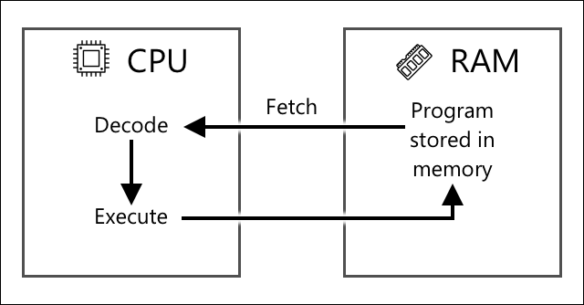
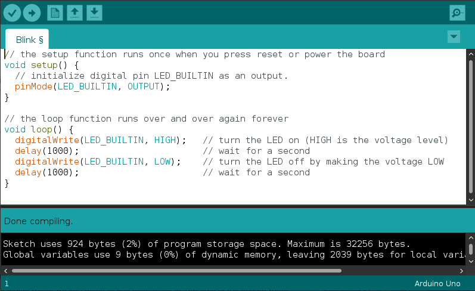

# Arduino vs Raspberry Pi

This section explores the differences between single board computers (SBC) such as the Raspberry Pi and micro-controllers (MCU) such as the Arduino.

## Single Board Computers (SBCs)

The Raspberry Pi is a single board computer (SBC), which means it has all the components of a full sized computer, however, they are attached to a single board.

	<a href="https://en.wikipedia.org/wiki/Raspberry_Pi"> Modules of a Raspberry Pi 4 </a>&nbsp; - Wikipedia.

As a full blown computer, the Raspberry Pi runs a Linux Operating System that manages:

- Device drivers (touch screens, buttons, LEDs, keyboard and mouse inputs, etc).
- Memory (per process RAM allocation).
- Networking (ethernet and wifi).
- Video output (GPU).

The Raspberry Pi can use any language that the Linux operating system supports. For example:

- Python
- JavaScript (including Node.js)
- C and C++
- Java
- C#
- etc

The Raspberry Pi's hardware, including the GPIO's, are available at the operating system level. Most of the languages listed above offer libraries that facilitate access and use of the hardware.

## Other SBCs

The Raspberry Pi is not the only SBC available for purchase. There are many other boards such as:
- [BeagleBone](https://beagleboard.org/bone)
- [Nvidia Jetson](https://www.nvidia.com/en-us/autonomous-machines/jetson-store/)
- [Rock64](https://www.pine64.org/devices/single-board-computers/rock64/)
- [Asus Tinker Board](https://tinker-board.asus.com/series.html)

## Microcontrollers (MCU)

A microcontroller board is a "bare-bones" form of a computing module.

> At its core, a microcontroller is a single chip capable of executing the **fetch-decode-execute cycle of a program**.

	<a href="https://github.com/microsoft/IoT-For-Beginners/blob/main/1-getting-started/lessons/2-deeper-dive/README.md"> Fetch-decode-execute cycle of a program </a>&nbsp; - Microsoft, IoT for Beginners.

One of the most well known microcontrollers today is the Arduino platform. It became popular with the introduction of the Arduino UNO (see image below) in 2003.

The heart of the Arduino UNO is the microcontroller Atmel328, which functions as both the CPU, the RAM (for run-time memory) and the Flash memory (for storing program instructions).

	<a href="https://lifehacker.com/diy-shrimp-microcontroller-replicates-an-arduino-uno-at-5965010"> Microcontroller Atmel328 in a basic setup compared to the Arduino UNO </a>&nbsp; The ShrimpingIt Projects.

Today there are dozens of variants of the Arduino board, far more capable and permanent than the original UNO.

	<a href="https://www.fiverr.com/yusuf1809/write-firmware-for-arduino"> Examples of Arduino compatible boards </a>&nbsp; Yusuf1809 on Fiverr.com.

Programs written for Arduino boards are typically written in C++.

The basic program structure is a `setup()` function that initializes pins and variables and a `loop()` function that loops forever.

The code needs to be compiled before it is flashed to the chip's flash memory.

## MCUs vs SBCs

Let's compare microcontrollers and single board computers using the Arduino platform and the Raspberry Pi.

|                   | [Raspberry Pi 4](https://www.raspberrypi.com/products/raspberry-pi-4-model-b/) | [Raspberry Pi Zero W](https://www.raspberrypi.com/products/raspberry-pi-zero-w/) | [Arduino Uno](https://docs.arduino.cc/hardware/uno-rev3) | [Arduino Portenta H7](https://store-usa.arduino.cc/products/portenta-h7?selectedStore=us) |
| ----------------- | ------------------------------------------------------------------------------ | -------------------------------------------------------------------------------- | -------------------------------------------------------- | ----------------------------------------------------------------------------------------- |
| Price (CAD)       | From $55                                                                       | From $15                                                                         | From $27                                                 | From $147                                                                                 |
| RAM               | 1GB to 8GB                                                                     | 512MB                                                                            | 2KB SRAM                                                 | Base model: 8MB, Custom: 64MB                                                             |
| CPU               | 1.5GHz quad-core ARMv8-A                                                       | 1GHz ARM1176JZF-S                                                                | 16MHz ATMega328P                                         | STM32 dual Cortex-M7+M4 32bit low power Arm                                               |
| GPIO              | 40 (no analog input)                                                           | 40 (no analog analog)                                                            | 14 including, 6 Analog inputs, 6 PWM                     | 28 including, 7 Analog inputs                                                             |
| Storage           | Micro SD, USB                                                                  | Micro SD, USB                                                                    | 32KB Flash memory                                        | Base model: 16MB Flash, Custom: Up to 128MB Flash storage                                 |
| Network           | Gigabit Ethernet, WiFi b/g/n & 5GHz AC                                         | 802.11 b/g/n wireless LAN, Bluetooth 4.1, Bluetooth Low Energy (BLE)             | Requires Shield Add On                                   | Murata 1DX dual WiFi 802.11b/g/n 65 Mbps and Bluetooth 5.1                                |
| Power Consumption | ~700+ mA (5V)                                                                  | 170 mA (5V)                                                                      | ~50 mA (5-12V)                                           | ? (5V)                                                                                    |

### Arduino Pros

- Low cost.
- Very low power consumption (ideal for battery use).
- No need for operating system.
- Best at single tasks (multi-threading possible).
- Provides analog pins.
- Easy learning curve.

### Raspberry Pi Pros

- Full Linux based OS.
- Lots of computing power (32 bit and 64 bit).
- Video and USB controllers onboard.
- 40 GPIOs (but none are analog).
- Integrated wifi, bluetooth and ethernet connectivity.

## References
[A deeper dive into IoT](https://github.com/microsoft/IoT-For-Beginners/blob/main/1-getting-started/lessons/2-deeper-dive/README.md) by Microsoft.

[Raspberry Pi vs Arduino: Which Board is Best?](https://www.tomshardware.com/features/raspberry-pi-vs-arduino) by Tom's Hardware.

[Arduino vs Raspberry Pi for Robotics](https://www.learnrobotics.org/blog/arduino-vs-raspberry-pi/) by Learn Robotics

### Video reference

 <iframe width="560" height="315" src="https://www.youtube.com/embed/p40OetppIDg" title="YouTube video player" frameborder="0" allow="accelerometer; autoplay; clipboard-write; encrypted-media; gyroscope; picture-in-picture" allowfullscreen></iframe>
