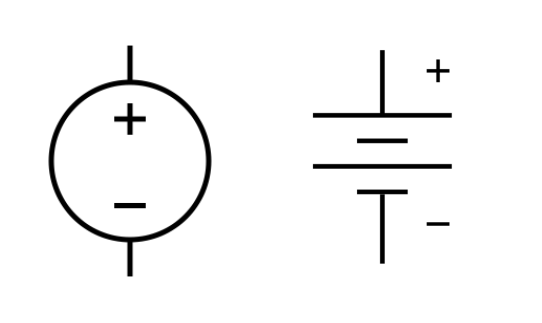
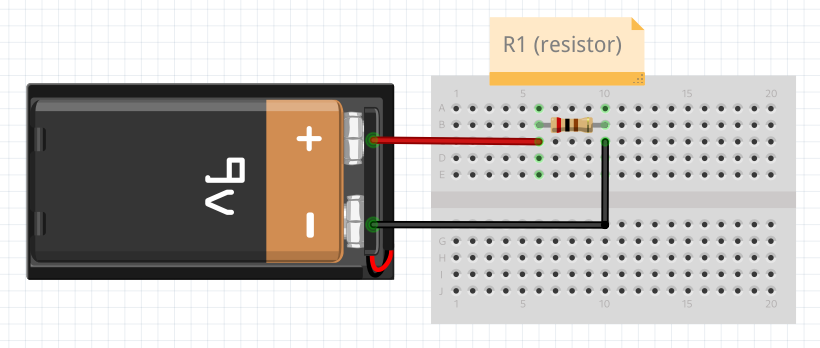
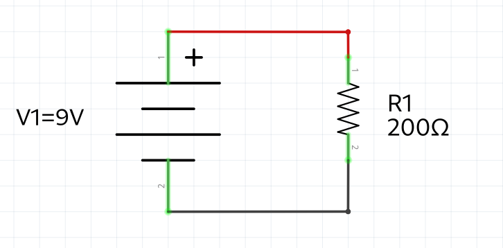
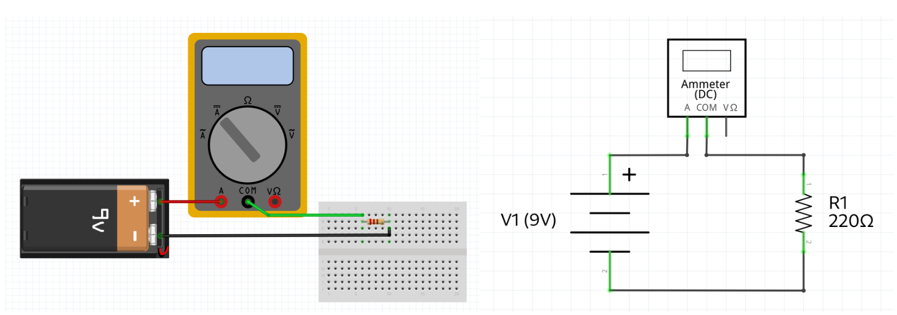
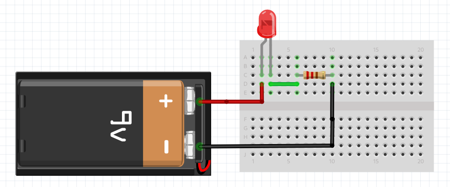
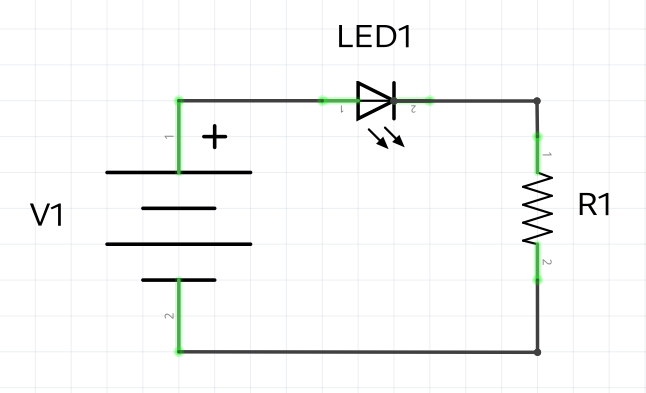
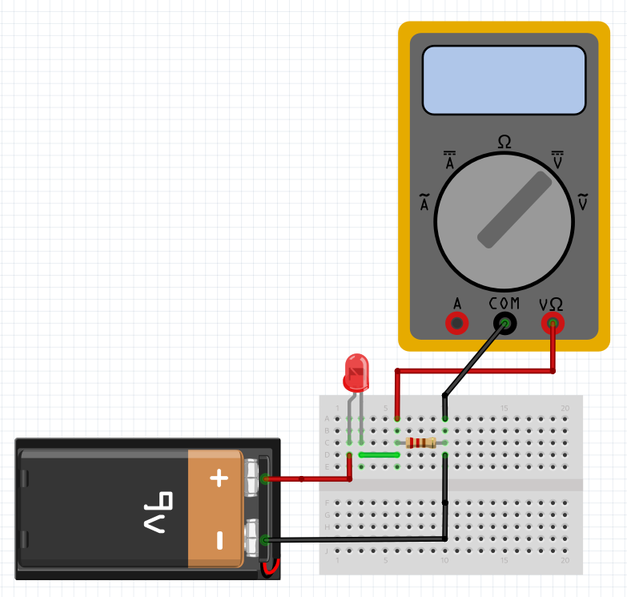
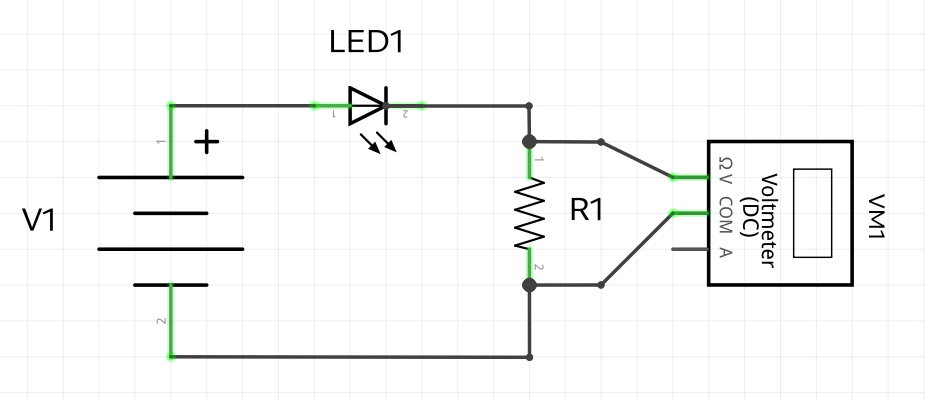

# Electronics: Ohm's Law
## Why Electronics?
This course is at the boundary of code and physical objects. We can access the GPIOs with code, however, your digital signals are being delivered with electricity.

Having a basic understanding of electronics will help you properly connect digital devices without damaging them.

## GPIO Physical Limits
The reTerminal has the following electrical constraints ([see official wiki](https://wiki.seeedstudio.com/reTerminal-hardware-interfaces-usage/#40-pin-raspberry-pi-compatible-pins)):

- An individual GPIO pin in the reTerminal can only safely draw **16mA** current .
- GPIO pins can only handle 3.3V.
- The power pins (3.3V and 5V) can handle a maximum of 2A.

 Whenever connecting LEDs of any other hardware that requires power it is important to limit the current and the voltages to the specs above.

 
## Units of Measurement: Volt, Amp, and Ohm

Bellow are the basic units that are used to measure electricity:

| Quantity   | Symbol | Unit            | Abbreviation |
| ---------- | ------ | --------------- | ------------ |
| Current    | I or i | Ampere ("Amps") | A            |
| Voltage    | V or E | Volts           | V            |
| Resistance | R      | Ohm             | Ω            |

An electric circuit is formed when a conductive path is created to allow electric charge to continuously move.

### Current

The movement of electric charge (electrons) through the conductors of a circuit is called a **_current_**, and it is often referred to in terms of “flow,” just like the flow of a liquid through a hollow pipe.

### Voltage

The force pushing the electrons to “flow” in a circuit is called **_voltage_**.

Voltage is a specific measure of potential energy that is always relative between two points. This is comparable to the pressure pushing water from a reservoir into a pipe.

> Voltage relates to the amount of potential energy **between two points**.
> 
> Without reference to **two relative points**, the term “voltage” has no meaning.

Voltage is added to a circuit by a voltage source, such as a batter or a power supply unit attached to a wall.

Below are the two symbols typically used to identify a voltage source in a circuit:

### Resistance

Current moves through the conductors with some degree of friction, or opposition to motion. This opposition to motion is more properly called **_resistance_**.

The amount of current in a circuit depends on the amount of voltage and the amount of resistance in the circuit to oppose current flow.

> Just like voltage, resistance is a quantity **relative between two points.**
> 
> Voltage and resistance are often stated as being “**between” or “across” two points** in a circuit.

Below are the two symbols used for a resistor:

## Ohm's law

Ohm's law describes the relationship between voltage, current and resistance.

> The amount of current through a metal conductor is directly proportional to the voltage  across it.
> 
> **V = IR**

Consider the following circuit:

The proper circuit diagram will be:

If V1=9V and R1 = 200Ω, what is the current running through the circuit?

Rearranging Ohm's law we get:

**I=V/R**

Therefore:

I = 9V / 200Ω = 0.045A (amps) or 45mA (milli amps).

We can measure the current by using a multimeter in "ammeter" mode.

The  multimeter must be added in series with the circuit. This means that the wiring must "go thorough" the multimeter.

## Voltage Drop Across Components

Consider the circuit below:

We must select the resistor value in order to maximize the life of the LED.

The following requirements apply:

- The ideal current across the LED is of 20mA.
- The voltage drop across the LED (Vled) is of 2.2V.
- The voltage source is 12V.

Using Ohm's law:

R1 = Vr / Ir
(Vr and Ir are the voltage and current across the resistor)

How do we find Vr and Ir?

Note that because there is a LED that is also "consuming" some voltage, R1 is no longer the same as V1.

> The total voltage drop across all components of the circuit must equal the source voltage.
> 
> This is know as Kirchhoff's Law

This means that the voltage dropped at the LED and the resistor **must add up to the same value as the source voltage**.

V1 = Vled + Vr

Vled was provided as a design constraint: Vled = 2.2V. Therefore we can easily calculate Vr:

Vr = V1 - Vled = 12V - 2.2V = 9.8V

It's possible to measure the voltage drop across the resistor by using a multimeter that measures the voltage difference before and after the resistor.

> Notice how the multimeter is not interrupting the circuit. It is rather "sampling" the circuit at two points.

Now that we know the voltage drop across the resistor, we are only missing the current flowing through it (Ir)

> Because the circuit only has a **single path**, the current leaving the source **is the same** as the current flowing through **all components**. 

Since we are optimizing for the LED lifespan, the target current is 20mA or 0.02A.

We now have all necessary information to calculate the resistance value:

R1 = Vr / Ir = 9.8V / 0.02A = 490Ω

## Resources & References

[Ohm’s Law - How Voltage, Current, and Resistance Relate](https://www.allaboutcircuits.com/textbook/direct-current/chpt-2/voltage-current-resistance-relate/) by All About Circuits

[Voltage Divider Circuits](https://www.allaboutcircuits.com/textbook/direct-current/chpt-6/voltage-divider-circuits/) by All About Circuits

<iframe width="560" height="315" src="https://www.youtube.com/embed/HsLLq6Rm5tU" title="YouTube video player" frameborder="0" allow="accelerometer; autoplay; clipboard-write; encrypted-media; gyroscope; picture-in-picture" allowfullscreen></iframe>

<iframe width="560" height="315" src="https://www.youtube.com/embed/7d4ymjU9NqM" title="YouTube video player" frameborder="0" allow="accelerometer; autoplay; clipboard-write; encrypted-media; gyroscope; picture-in-picture" allowfullscreen></iframe>

