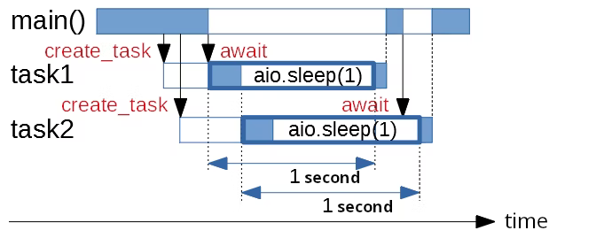

# Python Extras

This section explores intermediate Python topics that will write better IoT applications.

We'll explore:

- `__main__` and *top-level* environment
- Asynchronous programming with `asyncio`
- Passing terminal arguments to a script

## Enable Static Type Checking with Pylance

[Pylance](https://marketplace.visualstudio.com/items?itemName=ms-python.vscode-pylance) is the default language support for [Python in Visual Studio Code](https://marketplace.visualstudio.com/items?itemName=ms-python.python) extension. Pylance uses the [Pyright](https://github.com/microsoft/pyright) static type checker under the hood to supercharge Python IntelliSense in VS Code.

**Type checking is not enabled by default in Pylance**. To enable it, set the following VS Code configuration:

```json
{
  "python.analysis.typeCheckingMode": "basic"
}
```

Alternatively, use the VS Code configuration UI:


## `__main__` & top-level environment


Why include a  `if __name__ == "__main__":`  in your script?


There are two ways of executing Python code. Depending on how the code is executed, the global *string* variable `__name__` will take one of two values:

1. If the script is run by the Python interpreter :
	-  `__name__` has the value of `__main__`

2. Importing script as a separate Python module:
	- `__name__` has the value of the *module name*.

Let's illustrate these two cases below.

> **TL:DR**
> 
> - Official docs:
> 	- [`__main__`— Top-level code environment](https://docs.python.org/3/library/__main__.html#module-__main__ "__main__: The environment where top-level code is run. Covers command-line interfaces, import-time behavior, and ``__name__ == '__main__'``.") 
> - Summary discussion at Stackoverflow:
> 	- [What does if __name__ == "__main__": do?](https://stackoverflow.com/questions/419163/what-does-if-name-main-do)


### Executing as a Script

Consider the following script:

```python
# file my_script.py

print('Inside my_script.py, variable `__name__` is: ', __name__)
```

Executing this file with the Python interpreter:

```bash
$ python my_script.py

# Output
# Inside my_script, variable `__name__` is: __main__
```


### Executing as a Module

Consider a new file:

 ```python
 # file your_script.py
 
print('Inside your_script.py, variable `__name__` is: ', __name__)
```

Now modify `my_script.py` to import `your_script.py`:

```python
# file my_script.py

import your_script

print('Inside my_script.py, variable `__name__` is: ', __name__)
```

> When a file is imported as a module, **it's top-level code get's executed immediately**.

When we execute `my_script.py` again using the Python interpreter:

```bash
$ python my_script.py

# Output
# Inside your_script, variable `__name__` is: your_script
# Inside my_script, variable `__name__` is: __main__
```

The first print statement came from `your_script.py ` when it was imported by `my_script.py`.

Notice how inside `your_script.py`, the **variable `__name__`  was the file name because it was being run as a module** - from a different script (`my_script.py`).

### Top-level Code

All of the code that is at indentation level 0 gets executed is called the **top-level**.

`__main__` is the name of the environment where top-level code is run.

If a module is being run as a script (as in `mys_cript.py` above), then `__name__` is instead set to the string `"__main__"`.

You can test whether your script is being run directly or being imported by something else by testing what `__name__`  evaluates to:

```python
# another_script.py

def main():
	# Include whatever code here.

if __name__ == "__main__":
    main()  # Will only run if executing file as a script. 
```


## `Asyncio`

The library *asyncio* enables code to be **run concurrently**:
- Tasks share the execution thread while appearing to be executing in parallel.

> Asyncio API:
> -  [Coroutines and Tasks](https://docs.python.org/3/library/asyncio-task.html#asyncio-example-gather) (good intro to *asyncio*).
> 
> In-depth guide:
> - [Async IO in Python: A Complete Walkthrough](https://realpython.com/async-io-python/) by realpython.com.
> 
> Video Summary:
> - [How To Easily Do Asynchronous Programming With Asyncio](https://www.youtube.com/watch?v=2IW-ZEui4h4) by ArjanCodes


### Concurrent vs Parallel

It's important to note that **concurrent code does not necessarily mean parallel**.


*Concurrent does necessarily mean parallel execution. By [Ten thousand meters](https://tenthousandmeters.com/blog/python-behind-the-scenes-12-how-asyncawait-works-in-python/)*


> In Python, the only way to run parallel code is to use multiple CPU cores by running multiple Python interpreters that interact. See [multiprocessing module](https://docs.python.org/3/library/multiprocessing.html).


Asyncio is used to run **multiple tasks or multiple threads** concurrently but never at the same time (in parallel).


### Synchronous vs Async Execution

In typical programming, most tasks and processes are synchronous, meaning, they run **one at the time, always waiting for the previous taks to finish**

Synchronous is disadvantageous when there are many tasks that need to wait for external input or output before it can proceed. For example:

- The code was asked to sleep.
- Waiting for a HTTP response.
- Waiting for a Database call.
- Waiting to write to a file.
-


*Synchronous code execution by [RealPython.com](https://realpython.com/python-concurrency/)*

**Asynchronous** execution enables the execution of the next task while waiting for the external input/output. 


*Asynchronous code execution by [RealPython.com](https://realpython.com/python-concurrency/)*


> Note that the amount **CPU processing (blue area in the diagrams above) is the same** in both sync and async executions.
> 
> However, the async execution spends **less time waiting idle**. 


### Asyncio vs Threads

By default, asyncio works with task, not threads. However, it is possible to create new threads with asyncio.

#### Threads

Once a thread is created, it is managed by the Operating System (OS).

Thread execution can be halted and resumed whenever the OS deems necessary, **without any control from the application side**.

> In Python all threads run in the same CPU core due to the [GIL (Global Interpreter Lock)](https://realpython.com/python-gil/)

This type of time-slicing (execution time given for each thread) is called **preemptive multitasking**.

- Preemptive because the OS is anticipating the start and stop of each thread.


*Thread execution time being managed by the OS. By [Digikey.com](https://www.digikey.bg/en/maker/projects/getting-started-with-asyncio-in-micropython-raspberry-pi-pico/110b4243a2f544b6af60411a85f0437c)*


#### Asyncio Tasks

**Asyncio uses cooperative multitasking** to manage and share the CPU processing time (time-slicing).

> In **cooperative multitasking**, each task must explicitly yield (or pass) execution time back to the main loop so that the next task can start/continue.
> 


*Tasks yielding CPU execution time so that other tasks can run. By [Digikey.com](https://www.digikey.bg/en/maker/projects/getting-started-with-asyncio-in-micropython-raspberry-pi-pico/110b4243a2f544b6af60411a85f0437c)*

> In Asyncio, **tasks yield by using the `await` keyword.**


*Tasks yielding execution time with the `await` keyword. By [Adafruit.com](https://learn.adafruit.com/cooperative-multitasking-in-circuitpython-with-asyncio)*

In the image above, Task 1 (running function `f()`) yields execution time to Task 2 (running function `g()`)  by using the `await` keyboard and vice-versa.


### Coroutines, Tasks & Event Loop

In Asyncio, there are 3 types of awaitable objects:
- Coroutines
- Tasks
- Futures

#### Coroutines

Coroutines are functions that are awaitable.

They must be declared with the `async` keyword

```python
async def countdown(task_name, seconds):
	for i in range(seconds, 0, -1):
		print(task_name, i)
		await asyncio.sleep(1)
	print("done!")


async def main():
	await countdown("simple count", 4)

asyncio.run(main())

""" Output
simple count 4
simple count 3
simple count 2
simple count 1
done!
"""
```

In the example above, `countdown()`, `asyncio.sleep()` and `main()` are coroutines.

`countdown()` and `asyncio.sleep()` were called with `await` , however, `main()` was called with `asyncio.run()`

> In asyncio, all awaitable objects must run **inside an event loop**.
> 
> - The method `asyncio.run()` creates a "top-level" event loop

#### Tasks

**Tasks** are used to schedule coroutines _concurrently_.

Once a task is scheduled, it will run as soon as the event loop is available.

- Tasks are scheduled (wrapped) with `asyncio.create_task()`
- In order **to run a task to completion, it must be awaited**.

```python
async def main():
	# Scheduling and starting tasks
	taskA = asyncio.create_task(countdown("task A", 3))
	taskB = asyncio.create_task(countdown("task B", 2))

	# Doing something else while they run
	await asyncio.sleep(1)
	print("Everything, everywhere, all at once")

	# Awaiting for tasks to complete before ending main()
	# Try running this code without awaiting
	await taskA
	await taskB

asyncio.run(main())

""" Output
task A 3
task B 2
Everything, everywhere, all at once
task A 2
task B 1
task A 1
done!
done!
"""
```

The scheduling and execution of each task is illustrated in the diagram below:


Order of task execution. From [Qiita.com](https://qiita.com/everylittle/items/57da997d9e0507050085)

Instead of creating Tasks and awaiting them individually, it's possible to run multiple coroutines concurrently and wait for all of them:

```python
async def main():
    # Running and awaiting multiple coroutines

    await asyncio.gather(
        countdown("task A", 4),
        countdown("task B", 3)
    )

    await asyncio.sleep(1)
    print("Everything, everywhere, all at once")


asyncio.run(main())
"""
task A 4
task B 3
task A 3
task B 2
task A 2
task B 1
task A 1
done!
done!
Everything, everywhere, all at once
"""
```


#### Futures

A Future in Asyncio is the equivalent of a Promise in JavaScript. 

> It is rare that developers need to use a Future directly.


### Diving Further & References

The following are excellent resources for learning more about Asyncio:

- [Async IO in Python: A Complete Walkthrough](https://realpython.com/async-io-python/) by RealPython.com

### Asyncio Exercises

1. Create a program with *asyncio* that uses two function to display information "at the same time". Call the functions with arguments of your choice.
	- `countdown()`:
		- Take it from the examples above.
	- `blink()`:
		- **Arguments**:
			- A message that will be displayed periodically. Defaults to "Blink"
			- The number of seconds to flash the message.
			- How many times per second the message should be flashed.
		- **Return**:
			- The number of times the message was flashed.
		- Example:
			- calling `blink("Hello", 5, 2)` should return 10

2. Use the [library `requests`](https://docs.python-requests.org/en/latest/) to fetch 5 random pokemon names from the [Pokemon API](https://pokeapi.co/docs/v2#info).
	- Use a random number between 1 and 251 as the **pokemon id**.
	- Use the [API endpoint: `https://pokeapi.co/api/v2/pokemon/{id or name}/`](https://pokeapi.co/docs/v2#pokemon).
	- Use the `requests` built-in json decoder: [JSON Response Content](https://docs.python-requests.org/en/latest/user/quickstart/#json-response-content) 
	- Send 5 GET requests.
	- For each request, display the name of the randomly selected pokemon.
	- Time the total script execution with [`time.perf_counter()`](https://docs.python.org/3/library/time.html#time.perf_counter)


3. Use the [library `aiohttp`](https://docs.aiohttp.org/en/stable/client_quickstart.html) to fetch 5 "simultaneous" random pokemon names from the [Pokemon API](https://pokeapi.co/docs/v2#info).
	- Use a random number between 1 and 251 as the **pokemon id**.
	- Use the [API endpoint: `https://pokeapi.co/api/v2/pokemon/{id or name}/`](https://pokeapi.co/docs/v2#pokemon).
	- Use the `aiohttp` built-in json decoder: [JSON Response Content](https://docs.aiohttp.org/en/stable/client_quickstart.html#json-response-content)
	- Send 5 get requests at the same time using `asyncio`
	- For each request, display the name of the randomly selected pokemon.
	- Time the total script execution with [`time.perf_counter()`](https://docs.python.org/3/library/time.html#time.perf_counter)


## Passing Script Arguments

It's possible to pass command line arguments to a Python script directly from your shell:

```bash
$ python myscript.py first 2 True
```

The arguments passed are `first`, `2` and `True` . 

### `sys.argv`

The Python `sys` module provides access to these arguments via  `sys.argv`:

- `sys.argv` is a **Python list** of arguments. 

```pyhton
# myscript.py

print(f'Argument List: {sys.argv}')
```

Output:
```bash
$ python myscript.py first 2 True

Argument List: ['myscript.py', 'first', '2', 'True']
```

Notice the following:

- The first element in the list is the name of the script.
- Arguments are available as strings.

Unfortunately, we can't trust that the user will always pass arguments in the correct order and using appropriate data types. We would still need to parse the arguments and make sure they are valid.

Fortunately, there is a built-in module that can help us do that.


### `argparse`

[`argparse`](https://docs.python.org/3.10/library/argparse.html#module-argparse "argparse: Command-line option and argument parsing library.") is a built-in module that  makes it easy to write user-friendly command-line interfaces.

Once the script defines what arguments are required, `argparse` will figure out how to parse those out of [`sys.argv`](https://docs.python.org/3.10/library/sys.html#sys.argv "sys.argv"). The [`argparse`](https://docs.python.org/3.10/library/argparse.html#module-argparse "argparse: Command-line option and argument parsing library.") module also automatically generates help and usage messages, and issues errors when users give the program invalid arguments.

> For a basic tutorial of `argparse`, see [this page](https://docs.python.org/3.10/howto/argparse.html#id1).

In its simplest form, `argparse` must be imported and a parser must be instantiated:

```python
# myscript.py

import argparse
parser = argparse.ArgumentParser()
args = parser.parse_args()
print(args)
```

However, this will generate an error because we must tell argparse what argument flags and what data types to parse.

```bash
$ python myscript.py first 2 True

usage: myscript.py [-h]
myscript.py: error: unrecognized arguments: first 2 True
```

To "teach" `argparse` how to parse an argument we use the command `parser.add_argument()`

```python
# myscript.py
import argparse
parser = argparse.ArgumentParser()

parser.add_argument("word", type=str)
parser.add_argument("number", type=int)
parser.add_argument("toggle", type=bool)

args = parser.parse_args()

print(args)
print(args.word)
print(args.number)
print(args.toggle)
```

```bash
$ python myscript.py first 2 True

Namespace(word='first', number=2, toggle=True)
first
2
True
```

Notice how in the example above, **all arguments were positional**, which makes them  **mandatory**.
In other words, the order in which they are passed determines which variable they were being assigned to.

It's also possible to make arguments optional. In this case, they must be specified with the correct "Flag".

```python
# myscript.py
import argparse
parser = argparse.ArgumentParser()

parser.add_argument("--word", type=str)
parser.add_argument("--number", type=int)
parser.add_argument("--toggle", type=bool)

args = parser.parse_args()

print(args)
print(args.word)
print(args.number)
print(args.toggle)
```

```bash
$ python myscript.py --word first --number 2

Namespace(word='first', number=2, toggle=None)
first
2
None
```


### `argparse` References

- Article [10 tips for passing arguments to Python script](https://www.codeforests.com/2020/10/18/passing-arguments-to-python-script/) 


## Virtual Environments

This section shows the use the python virtual environments (virt. envs.) with the `venv` build-in tool.

`venv`  is the officially recommended way to manage virt. envs. but it's not the only one. Other tools such as [Conda](https://docs.conda.io/en/latest/index.html), [Pipenv](https://pipenv.pypa.io/en/latest/), [Poetry](https://python-poetry.org/) and [PDM](https://pdm.fming.dev/latest/) are other options.


> **Short guide by *python.org***
> 	- [Installing packages using pip and virtual environments](https://packaging.python.org/en/latest/guides/installing-using-pip-and-virtual-environments/#installing-packages-using-pip-and-virtual-environments)
> 
> **Detailed guide by *RealPython.com***
> 	- *[Python Virtual Environments: A Primer](https://realpython.com/python-virtual-environments-a-primer/) *


### Why Virtual Environments?

Python is not good at dependency management. We want to avoid:

1. **Avoid system pollution**
	- Installing packages to the OS’s global Python will mix them with OS relevant packages. This could have unexpected side effects on OS tasks.
	- Because of the reason above, updating OS packages might overwrite or delete global Python packages.
	
2. **Avoid project dependency conflicts**
	- Python projects might require different versions the same external library.
	
3. **Making projects reproducible in other environments.**
	- Since all dependencies are isolated to a specific project, it is easier to identify and document them.
	- Once the dependencies are "locked", the project depency can be easily reproduced in other environments.


### Virtual Dependency Steps

Creating and using virtual environments involved the following steps:

1. Creation
2. Activation
3. Installing dependencies
4. Deactivation
5. Locking dependencies


### Creating

1. Create a new folder for the project (if one doesn't already exist).

2. `cd`  into the folder and create a new virt. env.:

```shell
$ python3 -m venv my-env
```

Note that `my-env` is the name of your virtual environment. `venv` is a popular choice.

### Activate & Deactivate

Once created, the virt. env. needs to be activated.

```shell
# Linux
$ source my-env/bin/activate

# Windows
$ my-env/Scripts/activate.bat
```

> **Note:** You can work with virtual environments without activating it.
> To do this, [provide the full path](https://realpython.com/python-virtual-environments-a-primer/#it-runs-from-anywhere-with-absolute-paths) to its Python interpreter when executing a command.
> 
> Typically, you’ll want to activate the virtual environment to avoid repeatedly having to type long paths.

To deactivate:

```shell
# Notice the shell prompt indicates a virt. env. is active
$ (my-env) deactivate
```


### Installing Packages with `pip`

Once a virtual environment is active, **packages installed with `pip` will be local to that virtual environment.**

By default, project packages are installed in:

```
project-folder
	|- <project-venv>
	|		|- lib
	|			|- python3.X
	|					|- site-packages 
```

For example, installing `aiohttp`:

```shell
# Notice the shell prompt indicates a virt. env. is active
$ (my-env) pip install aiohttp
```


### Using  `requirements.txt`

Project dependencies can be listed in a file for portability. By convention, the file `requirements.txt` contains all the dependencies of a project created with a virtual environment.

> This is analogous to `package.json` for Node.Js projects

**To generate** a `requirements.txt` for an existing project:

```shell
$ pip freeze > requirements.txt
```

**To install** packages from a `requirements.txt`:

```
$ pip install -r requirements.txt
```


### Moving Virtual Environments

If you move a project that uses virtual environments to a different folder, **you must re-initialize the virtual environment.**

From the [official docs](https://docs.python.org/3/library/venv.html#how-venvs-work):

> Scripts installed in environments contain the absolute paths to their environment’s interpreters.
> 
> - Because of this, environments are inherently non-portable. You should always have a simple means of recreating an environment (for example, have a requirements file `requirements.txt`, and invoke `pip install -r requirements.txt`.

### Virtual Env Exercises

The following exercises are meant for familiarization with `venv`.

1. Compare packages installed with `pip` inside and outside of a new virtual environment (virt. env.):
	1. List all globally installed `pip` packages: `pip list`
	2. Create a new folder and use `venv` to create a virtual environment inside.
	3. Activate the new virt. env..
	4. List the `pip` packages as seen from inside the active virtual environment.
	5. Deactivate the new virtual environment.
	

2. Complete the following steps inside the virtual environment (virt. env.) you created in the previous question.
	1. Activate the virt. env.
	2. install the following libraries:
		- [howdoi](https://pypi.org/project/howdoi/)
		- [pyjokes](https://pyjok.es/) 
	3. List all pip packages to see the extra dependencies that got installed.
	4. Have some fun using both installed packages (see their docs).
	5. Export the dependency list to `requirements.txt` by using `pip freeze`.
	6. Deactivate the virt. env.
	7. Move `requirements.txt`  to one folder level above the project folder (so it's not deleted in the next step).
	8. Delete the project folder.


3. Create a new project and virtual environment using the `requirements.txt` from the previous exercise.
	1. Create a new project folder with a virtual environment inside.
	2. Move `requirements.txt` inside the new project folder.
	3. Install project packages using `requirements.txt`


