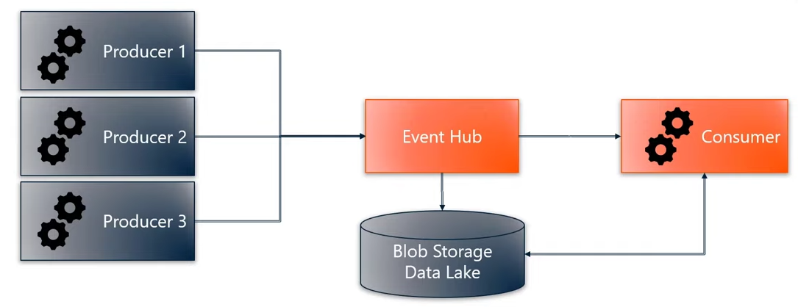

# Data Routing & Processing
## Data Analysis
### Azure Time Series Insight
[Azure Time Series Insights Gen2](https://docs.microsoft.com/en-us/azure/time-series-insights/overview-what-is-tsi) is an open and scalable end-to-end IoT analytics service.

You can use it to collect, process, store, query and visualize data at Internet of Things (IoT) scale--data that's highly contextualized and optimized for time series.

### Azure Stream Analytics

Stream Analytics is intended for **real-time data analysis**.

This service is intended for immediate data processing, before it is batched or stored. 

If real-time data is not required, consider something else.

### Data Factory

### Azure Synapse

## Azure Event Hub
[Azure Event](https://docs.microsoft.com/en-us/azure/event-hubs/event-hubs-about#main) Hubs is a big data streaming platform and event ingestion service. It can receive and process millions of events per second.

[TO VERIFY]
The Event Hub routes live data from a data producer (publisher) to one or many data consumers (subscribers).

The focus of Event Hub is to route **streaming data**, and not storing it on the Event Hub itself. This means that if a consumer is not online when Event Hub forwards the message, the **data will be dropped**.

> Think of Event Hub as a broker where QoS is always 0.
> 
> Note: message retention is technically possible for up to 7 days for testing and development purposes.

Event Hub can route messages to some sort of permanent storage (such as blob storage or data lake) withing Azure, which is guaranteed to be online and thus can be consumed at a later time.

<a href="https://www.youtube.com/watch?v=zm1XUTAa9sc"> Data flow through Event Hub being forwarded to a consumer and stored </a>&nbsp; Azure Event Hubs, Blaize Stewart.

## Visualizing Data

### Data Explorer
[Azure Data Explorer](https://docs.microsoft.com/en-us/azure/data-explorer/data-explorer-overview) is a big data analytics platform that makes it easy to analyze high volumes of data in near real time.

The Azure Data Explorer toolbox gives you an end-to-end solution for data ingestion, query, visualization, and management.

Data Explorer has its own Web UI Dashboard but can also connect to Grafana, Power BI, Excel, and others. See [here for details](https://docs.microsoft.com/en-us/azure/data-explorer/viz-overview).

Below is a [solution example for IoT analytics with Data Explorer](https://docs.microsoft.com/en-us/azure/architecture/solution-ideas/articles/iot-azure-data-explorer).

## Power BI

Power BI is a collection of software services, apps, and connectors that turn unrelated sources of data into coherent, visually immersive, and interactive insights.

	