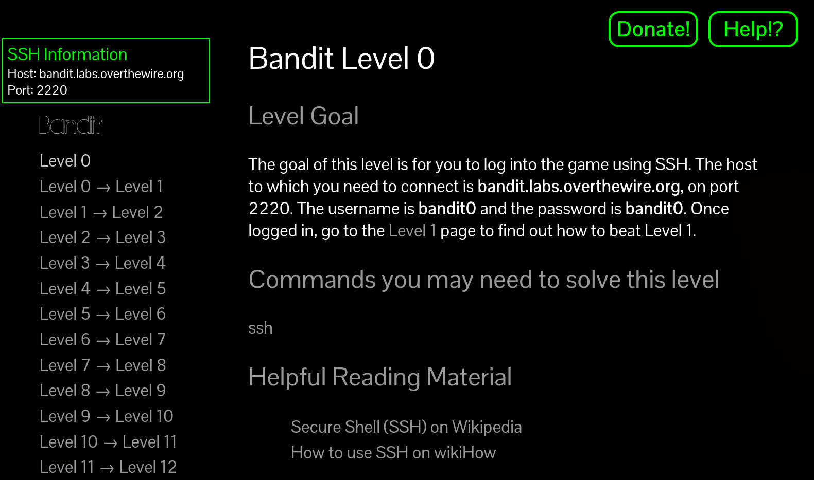

______________________________________________________________________

## title: "Lab 2: Bash Mash" subtitle: Review bash fundamentals by completing the bandit game. date: 2025-02-01

## Objectives

1. Review Bash essentials

   1. Using bash on the command line
   1. Creating and running bash scripts
   1. Review/Learn bash shell commands / operations

## Overview

This lab walks through setting up the developer environment we will use throughout the
semester, followed a short lab reviewing and developing `bash` skills.

### Context

In this course, we will frequently run code and commands on a raspberry pi.

An efficient way to work on a remote computer like the pis is to setup a remote `bash`
connection using `ssh`.

That way, you can *write* code on a preferred computer, while *running* code and other
commands directly on the raspberry pi as you work.

Using `ssh` effectively requires getting comfortable with the CLI shell -- in this course,
our shell will be `bash`.

Part of getting comfortable with `bash` is simply getting in the habit of *using* it for
*useful* things.

### Deliverables

- [Documenting your progress](#documenting-your-progress): Progress on
  `bandit-instructions.txt` committed to the `lab-0` branch of this repository
  - A completed `bandit-instructions.txt` up to and including Level 7 is worth 100%.
  - Some marks will be docked for missing levels/information in the `.txt`
  - Feedback will be given directly in the `lab-0` pull request.
- [In-class demo](#in-class-demo): Use `less` to preview progress documenting the
  `bandit-instructions.txt`
  - The `bandit-instructions.txt` *does not* have to be complete to get full marks for the
    in-person demo.

### Deadline

- In class demos: Friday Jan 31 (beginning of class)
- `bandit-instructions.txt` progress committed: Friday Jan 31 (end of day)

## Using bash: complete the Bandit game

To get us warmed up with using `ssh` to connect to a remote computer, and using the
various `bash` tools at our disposal, the [bandit] game is great practise.

For this lab, we will aim to complete **up to Level 8**.

[][bandit] *Each level of the bandit game requires you
use one or more bash commands to complete the level.*

### Getting started

- Open a terminal on your developer environment. All `ssh` commands for the game will be
  done here.
  - On Windows, use your WSL container
  - If working on OSX or Linux, use your default terminal
- Open `lab-0/bandit-instructions.txt` in your editor
  - You will use this file to record your progress through the lab.
  - The rubric for this lab is based on completing this file.
- The instructions for the lab are contained in the game itself.
  - To start the lab, read the [Note for beginners][bandit]
  - Then proceed to Level 0

> [!NOTE] if you are getting “hostname not resolved” issues in WSL, follow the steps
> below:
>
> 1. sudo vim /etc/wsl.conf , add the following:
>
> > [network]
> >
> > generateResolvConf = false
>
> 2. sudo vim /etc/resolv.conf , add the following:
>
> > nameserver 8.8.8.8
>
> 3. sudo chattr -f +i /etc/resolv.conf
>
> For more detail, see
> [https://askubuntu.com/questions/1364984/dns-not-working-on-wsl](https://askubuntu.com/questions/1364984/dns-not-working-on-wsl)

#### Extra info & Hints

- Each `level` of the game challenges you to log in to a given `user` on a linux server
  hosted at bandit.labs.overthewire.org.
  - We'll be doing this a lot when we `ssh` into our raspberry pis throughout the lab.
- To complete each level, you need to find the password for that user. This password is
  stored on a file in that `user` account on the server.
- Each level, you are given **Commands you may need to solve this level** -- the levels
  can be solved in many different ways, using *one or more of those commands*.
  - That is: you will never need a command that is NOT listed in the **Commands** section.
    But, you do not have to use all of them; there are many ways to solve each puzzle.
  - Make sure you look at the commands available to you at each step, the hints are given
    for good reason.
- Use **man <command>** to see what the suggested command can do for you. Use `Ctrl + d`
  and `Ctrl + u` to scroll up and down the terminal efficiently, and `/` to search.

### Documenting your progress

As you complete each level, write down in `lab-0/bandit-instructions.txt` the following:

- the password needed to start the next level
- the commands used to find the file
- comments explaining the commands
  - e.g. necessary parameters/flags

> [!NOTE] In each level, the password is a long string of random characters stored in a
> file on the server. You will need to copy and paste the password frequently -- from your
> `bandit-instructions.txt` and to your bandit game terminal.
>
> Copy/paste is a bit different on terminals than you may be used to:
>
> - Highlight the text holding `Left+click`
> - Copy the text using `Ctrl+Shift+C`
> - Paste the text using `Ctrl+Shift+V`

Follow the format in the `bandit-instructions.txt` file. Make sure you read and follow the
instructions given in the comments (marked by `#`).

As you complete the `bandit-instructions.txt` file, track your progress on the `lab-0`
branch using `git commit`. Before you finish working, make sure you `git push` your
commits to upstream `lab-0` branch of this repository.

**Don't be shy**: you should be `committing` and `pushing` your progress to your branch
regularly, even if it is not finished -- this will let you continue where you left off
easily no matter what computer you are working on.

The rubric for this lab is based on completing this file:

- 100%: All levels up to and including Level 7 are documented correctly
- Marks off for mistakes or missing levels.

### In-class demo

> [!NOTE] Wait until you have completed, documented, committed, and pushed at least 2 or 3
> steps of the bandit game before beginning these instructions.

Another good use for `bash` and the terminal is not just commands and remote connections
-- it's actually a great tool for documentation, too.

To get a sense for that, I want you to show me that you can use `less` to do the
following:

- navigate through your `bandit-instructions.txt` without needing my instructions
- find commands/passwords for a given level by searching
- copy/paste information from your file to another terminal

Remember that the `man` command USES `less` by default -- so if you have been using `man`,
you will be used to the interface. If not, practise! See **TODO** for more information.

You do not have to be finished the whole lab to get full marks on the demo -- you just
have to have done a few of the levels.

[bandit]: https://overthewire.org/wargames/bandit/
