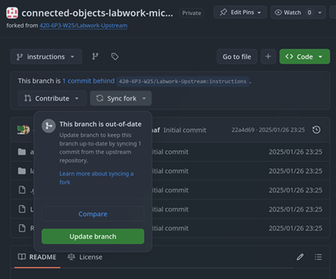
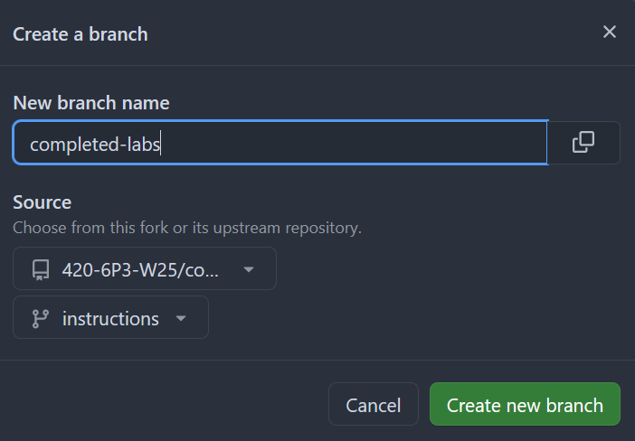
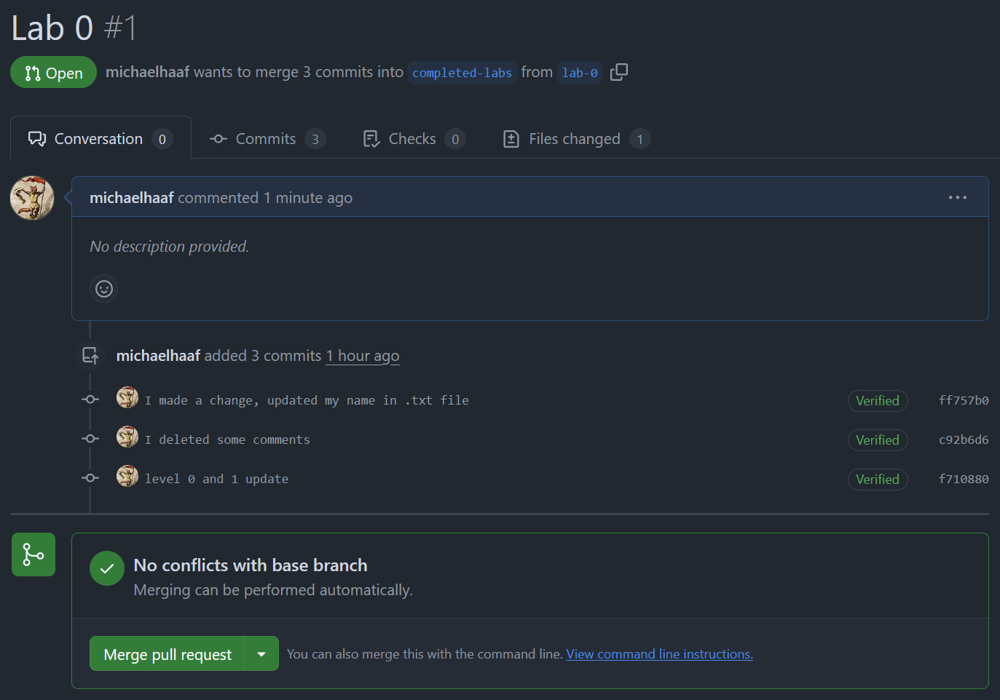
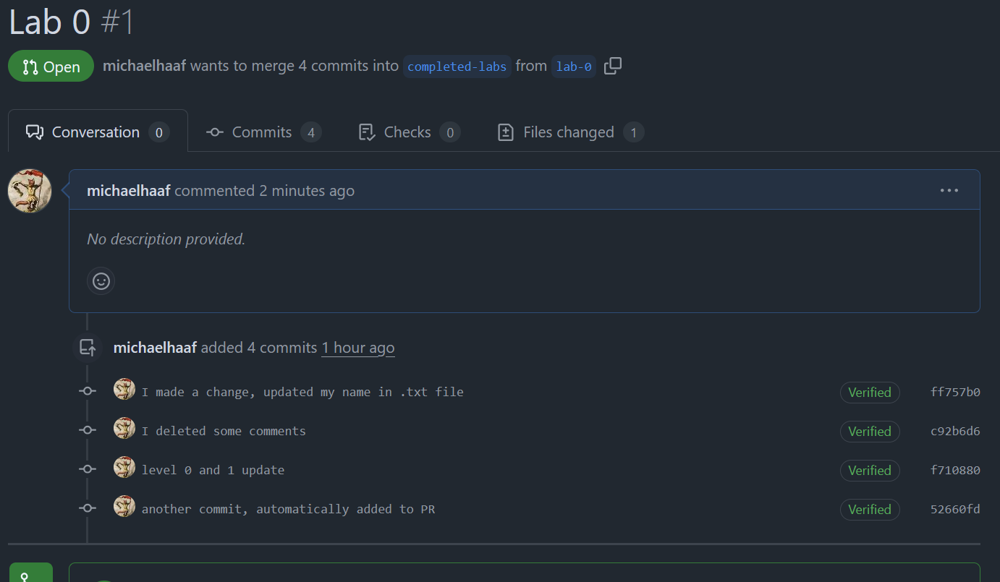
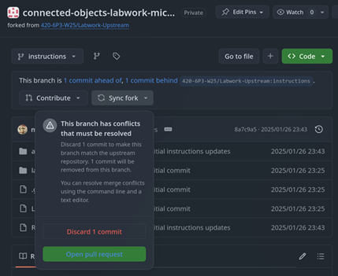

Throughout the semester, all Connected Objects lab work will take place in the `coursework` repository initialized by GitHub Classrooms.

Last year, there were **8** labs in total, each worth 1-5%, comprising a total of 27% of the final grade[^1].

This year should be similar (there may be more labs, but each worth less).

## Lab listing

:::{toctree}
:glob:
*/*
:::


## General Lab Instructions

The following sections contain instructions that are relevant for all labs. 

There is a bit of set-up for `lab-0`, but it will be re-used for future labs.

>[!NOTE]
> The instructions and starter code for each lab are stored in the `lab-*` directories of the repository.
> For example, instructions for Lab 0 are located in `lab-0/README.md`, and various other files in `lab-0/` are provided as starter code.

### Branches

Your repository begins with just one branch:

- `instructions`:
  - This branch is set to track my [Labwork-Upstream](https://github.com/420-6P3-W25/Labwork-Upstream)[^upstream] repository.
  - **DO NOT commit any work to this branch!**
  - Your `instructions` branch will be overwritten by any changes I make to the upstream `instructions` branch.


[^upstream]: The word "upstream" when referring to repositories is technical but intuitive: your branch is "downstream" of mine, which means that any changes made to my repository are available to your repository (but not the other way around).

After `lab-0`, your repository will have the following branches:

- `lab-0`:
  - All of your lab work will take place on `lab-*` branches you create for each lab
- `completed-labs`:
  - Once your lab has been graded, we will merge your lab branch into `completed-labs`.
  - More instructions for creating/using this branch in `lab-0`.
  - Similar to `instructions`, you should not make direct commits to this branch.

### Create a branch for each lab

For each lab, you will create a new branch. For example, to begin lab 0, you will create a branch called `lab-0`.

There are many ways to do this:

- Using the GitHub website
- Using VSCode
- Using the command line

#### Using the GitHub website

See [the "using GitHub" section of the course notes on this topic](https://john-abbott-college.github.io/6P3-Notes/notes/github-basics/#creating-a-branch-using-the-github-website).

#### Using VSCode

See [the "using VSCode" section of the course notes on this topic](https://john-abbott-college.github.io/6P3-Notes/notes/github-basics/#creating-a-branch-using-vscode).

#### Using the command line

See [the "using the command line" section of the course notes on this topic](https://john-abbott-college.github.io/6P3-Notes/notes/github-basics/#creating-a-branch-using-the-command-line).

### Keep `instructions` up to date

As the semester progresses, new labs will appear in this repository on the `instructions` branch.



*A "Sync fork" dropdown will appear whenever the upstream repository has instruction updates*

### Committing your progress

As you make progress in the lab work, use `git commit` to make commits on the lab work branch (for example, `lab-0` for work on lab 0).

To upload your progress for e.g. to get work done on other computers, use `git push` to update the lab work branch on the remote repository.

### Create a `completed-labs` branch

Once you have made a few commits to your `lab-*` working branch, you can set up a Pull Request which I will use to give you feedback. 

First, created a branch called `completed-labs` in this repo.



*Creating this branch is the same as creating any other branch. Just make sure the source branch is still `instructions` on your repo.*

Next, create a pull request between your `lab-*` branch and the `completed-labs` branch:



*Here is what your lab-0 (and all other lab) pull requests should look like: **your-username** wants to merge n commits into `completed-labs` from `lab-*`*

You don't have to wait until you're finished your lab to make the pull request. As you continue pushing to `lab-*`, your commits will automatically show in the pull request:



*After creating a 4th commit and pushing that commit to the `lab-0` branch, the pull request was  updated automatically.*

After the lab deadline, I will put feedback in the pull request between your lab work branch and the `completed-labs` branch.

## Troubleshooting

### `instructions` branch has conflicts

In general, you should not make ANY commits to the `instructions` branch.

In case you do by accident, that's okay -- there are two steps:

1. If you want to keep the changes you made:

```bash
# Ensure you are on the instructions branch
git switch instructions

# How many commits do you need to undo? 
# The command you run changes depending on the number. Some examples:

# Undo just the most recent comment (one commit)
git reset --soft HEAD^

# Undo the last 3 commits
git reset --soft HEAD~3

# Check that you're no longer "ahead" of the instructions branches,
# and that your changes from the commits you've undone are now staged
git status

# Switch to your lab branch
git switch lab-0

# Redo the commits on lab-0
```

You can skip the above steps if you don't care about your changes.

2. Discard the commits (let your `instructions` branch be overwritten by the upstream)

Click "Sync fork" and choose the "Discard commits" option.



*On the `instructions` branch, you should Discard any commits you accidentally make to ensure your instructions are up to date*

### Force `instructions` to match upstream using `git`

To ensure your `instructions` branch is up to date with upstream, and doesn't have any extra commits, you can add the upstream repo as **another remote** for your local repository.

```bash
# Double check that you are in the right repository, on the `instructions` branch
git switch instructions
git status

# Add the upstream
git remote add upstream https://github.com/420-6P3-W25/Labwork-Upstream/

# Verify that you now have two remote repositories:
#   origin: your repository
#   upstream: the upstream repository
git remote -v
origin  https://github.com/420-6P3-W25/connected-objects-labwork-hichael-maaf (fetch)
origin  https://github.com/420-6P3-W25/connected-objects-labwork-hichael-maaf (push)
upstream        https://github.com/420-6P3-W25/Labwork-Upstream/ (fetch)
upstream        https://github.com/420-6P3-W25/Labwork-Upstream/ (push

# Update all branches
git fetch --all
# here you will have to enter your token from the previous step! Open another terminal window and run
# pass github/token | clip.exe

# Force your instructions branch to be the same as the upstream/instructions branch
# Double check you are on the instructions branch
git status
git reset --hard upstream/instructions

# See that your branch is up to date with upstream/instructions and NOT origin/instructions
git status

# Force the change on your repositories origin/instructions
git push --force
```

[^1]: In the course outline, Labs+Assignments is 45%. The two assignments will be 9% + 9%

