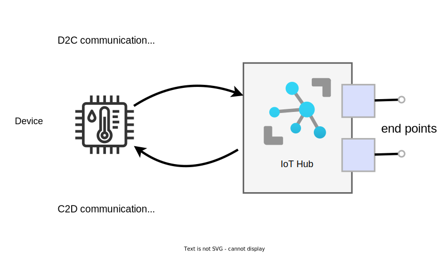

# Communication: Device & Cloud

Communication for IoT systems should be bi-directional:

- Device to Cloud (D2C)
- Cloud to Device (C2D)

Azure offers a variety of ways of exchanging information in both directions. In this lesson we'll look at the specifics of how these messaging systems work.




## Azure IoT Protocols
IoT Hub allows devices to use the following protocols for device-side communications:

-   [MQTT](https://docs.oasis-open.org/mqtt/mqtt/v3.1.1/mqtt-v3.1.1.pdf) (including over WebSockets)
-   [AMQP](https://docs.oasis-open.org/amqp/core/v1.0/os/amqp-core-complete-v1.0-os.pdf) (including over WebSockets)
-   HTTPS

By now you are well familiar with MQTT and HTTPS.

AMQP is not covered in this course, however, it is also a popular protocol for IoT communication. It is used for most of Azure IoT internal communication.

AMQP is more complex and has slightly more over head than MQTT, thus consuming more bandwidth and device memory. However, it does not requires a broker (although one can be used) and has extra features for security and flow control.

> The choice of protocol is a design choice that is **implemented when using  libraries from the [Azure IoT SDKs](https://github.com/Azure/azure-iot-sdks)** (ex.: when instantiating a client or a connection object).
> 
> For example, the **Azure IoT SDK for python uses MQTT by default**.

If you would like to know more about AMQP and how it differs from MQTT, see the video on "Diving Deeper".


## Device to Cloud (D2C) Communication

IoT Hub exposes three options for sending information from the device to the cloud or solution back end:

- [Device-to-cloud messages](https://docs.microsoft.com/en-us/azure/iot-hub/iot-hub-devguide-messages-d2c) for time series telemetry and alerts.
        
- [File uploads](https://docs.microsoft.com/en-us/azure/iot-hub/iot-hub-devguide-file-upload) for media files and large telemetry batches uploaded by intermittently connected devices.

- [Device twin's reported properties](https://docs.microsoft.com/en-us/azure/iot-hub/iot-hub-devguide-device-twins) for reporting device state information such as configuration or last known state. More on Device twins later in the course.


## Cloud to Device (C2D) Communication

IoT Hub provides three options for devices to receive information and commands from the cloud or back-end app:

- [Cloud-to-device messages](https://docs.microsoft.com/en-us/azure/iot-hub/iot-hub-devguide-messages-c2d) for one-way notifications to the device.

- [Direct methods](https://docs.microsoft.com/en-us/azure/iot-hub/iot-hub-devguide-direct-methods) follow a request-response pattern and are meant for communications that require immediate confirmation of their result. For example, interactive control of the device, such as turning on a fan.
    
- [Twin's desired properties](https://docs.microsoft.com/en-us/azure/iot-hub/iot-hub-devguide-device-twins) for long-running commands intended to put the device into a certain desired state. For example, set the telemetry send interval to 30 minutes. More on Device twins later in the course.


## End-points

IoT Hub also exposes multiple end-points that act as data input and output to various other actors.

For example, all messages received from a device are also forwarded to a "device to cloud message" end-point. An external client such as VS Code or Azure CLI can connect to this end-point and read the D2C messages sent to IoT Hub.

> You can think of **IoT Hub as a broker** and the **end-points as topics**.
> A client can subscribe to a topic and receive forwarded messages.
> 
> By default, messages are routed to a built-in endpoint.

IoT Hub allows data retention in the built-in end-points for a maximum of 7 days (1 day by default).

For a list of all built-in end-points see [IoT Hub endpoints reference](https://docs.microsoft.com/en-us/azure/iot-hub/iot-hub-devguide-endpoints).

The [Azure IoT SDKs](https://docs.microsoft.com/en-us/azure/iot-hub/iot-hub-devguide-sdks) article describes the various ways to access these endpoints.


## Message Anatomy

As previously mentioned, IoT Hub messages can be used for both D2C or C2D communication.

**An IoT Hub message consists of:**

- A predetermined set of **system properties**.

- A set of **application properties**: A dictionary of string properties that the application can define and access, without needing to deserialize the message body.

- An opaque binary body (the payload / application data).
    
(Property names and values can only contain ASCII alphanumeric characters).

<br>
Below is an example of a message **as they are received by the IoT Hub**.

> Note that creating and manipulation of the message on the device-side will look different. Many properties are automatically set on message by the SDK.

```json
{ 
  "message": {
   
    "systemProperties": { 
      "contentType": "application/json", 
      "contentEncoding": "UTF-8", 
      "iothub-message-source": "deviceMessages", 
      "iothub-enqueuedtime": "2017-05-08T18:55:31.8514657Z" 
	},
     
    "appProperties": { 
      "processingPath": "{cold | warm | hot}", 
      "verbose": "{true, false}", 
      "severity": 1-5, 
      "testDevice": "{true | false}" 
    },
     
    "body": "{\"Weather\":{\"Temperature\":50}}" 
  } 
} 
```


System properties are added for all users and identify content of the message.
Users can selectively add application properties to the message.

For a list of system and application properties that can be read or set on messages, see:

- [System Properties of D2C IoT Hub messages](https://docs.microsoft.com/en-us/azure/iot-hub/iot-hub-devguide-messages-construct#system-properties-of-d2c-iot-hub-messages)
- [Application Properties of D2C IoT Hub messages](https://docs.microsoft.com/en-us/azure/iot-hub/iot-hub-devguide-messages-construct#application-properties-of-d2c-iot-hub-messages)
- [System Properties of C2D IoT Hub messages](https://docs.microsoft.com/en-us/azure/iot-hub/iot-hub-devguide-messages-construct#system-properties-of-c2d-iot-hub-messages)

### Application Properties in Python

To send device-to-cloud messages the method `IoTHubDeviceClient.send_message(message)` is used. This method can receive a string or a `Message` object. Typically we've been passing a json string with the telemetry payload and the `Message` object is created automatically for you ([as per the docs](https://docs.microsoft.com/en-us/python/api/azure-iot-device/azure.iot.device.iothubdeviceclient?view=azure-python#azure-iot-device-iothubdeviceclient-send-message "https://docs.microsoft.com/en-us/python/api/azure-iot-device/azure.iot.device.iothubdeviceclient?view=azure-python#azure-iot-device-iothubdeviceclient-send-message")).
    
You can, however, have more control over the properties of the `Message` object to be sent. As mention in [Application Properties of D2C IoT Hub messages](https://docs.microsoft.com/en-us/azure/iot-hub/iot-hub-devguide-messages-construct#application-properties-of-d2c-iot-hub-messages), there are many properties you can set yourself, including **custom application properties**. See the [docs for the `Message` class](https://docs.microsoft.com/en-us/python/api/azure-iot-device/azure.iot.device.message?view=azure-python "https://docs.microsoft.com/en-us/python/api/azure-iot-device/azure.iot.device.message?view=azure-python").
    
See the example in [azure-iot-sdk-python](https://github.com/Azure/azure-iot-sdk-python "https://github.com/Azure/azure-iot-sdk-python")/[azure-iot-device](https://github.com/Azure/azure-iot-sdk-python/tree/main/azure-iot-device "https://github.com/Azure/azure-iot-sdk-python/tree/main/azure-iot-device")/[samples](https://github.com/Azure/azure-iot-sdk-python/tree/main/azure-iot-device/samples "https://github.com/Azure/azure-iot-sdk-python/tree/main/azure-iot-device/samples")/[sync-samples](https://github.com/Azure/azure-iot-sdk-python/tree/main/azure-iot-device/samples/sync-samples "https://github.com/Azure/azure-iot-sdk-python/tree/main/azure-iot-device/samples/sync-samples")/**send_message.py** to understand how to set message properties.


> The messages described above (D2C and C2D communication) are typically created at the device or application with the help of a SDK (Software Development Kit) library.

> See notes on Azure IoT SDKs for references to libraries and examples provided by Azure.


## Direct Methods

IoT Hub gives you the ability to invoke direct methods on devices from the cloud. For example, to trigger a relay or ask the device to initiate a upload process.

Similarly to HTTP, direct methods represent a request-reply interaction with a device. The request sender needs to know immediately if the request succeeded or failed. For example, turning on a light from a phone.

The life-cycle of a Direct Method is as follows:


1. A service application (such as a back-end or mobile app) sends a Direct Method request to the device.
	- This is typically done using a SDK library running on the application or "manually" via a HTTPS call to IoT Hub.

2. The device receives the Direct Method, processes it and prepares a response.
	- Also typically done using a SDK library running on the device.

3. The response is sent back to the sender of the Direct Method.

4. The application inspects the response using a call-back function and decides what to do next.
	- Callback calls are typically provided by a SDK library running on the application or "manually" by processing the HTTP response.


For details see [Understand and invoke direct methods from IoT Hub](https://docs.microsoft.com/en-us/azure/iot-hub/iot-hub-devguide-direct-methods)

## Diving Deeper 🤿

If you would like to have a "bigger picture" view of how the different Azure IoT services fit together, watch the video below by Blaize Stewart.

<iframe width="560" height="315" src="https://www.youtube.com/embed/UA15WTgZlYs" title="YouTube video player" frameborder="0" allow="accelerometer; autoplay; clipboard-write; encrypted-media; gyroscope; picture-in-picture" allowfullscreen></iframe>


To learn more about AMQT and how it differs from MQTT, see the presentation below by Ken Giusti.

<iframe width="560" height="315" src="https://www.youtube.com/embed/g3e9lDlMn5M" title="YouTube video player" frameborder="0" allow="accelerometer; autoplay; clipboard-write; encrypted-media; gyroscope; picture-in-picture" allowfullscreen></iframe>
