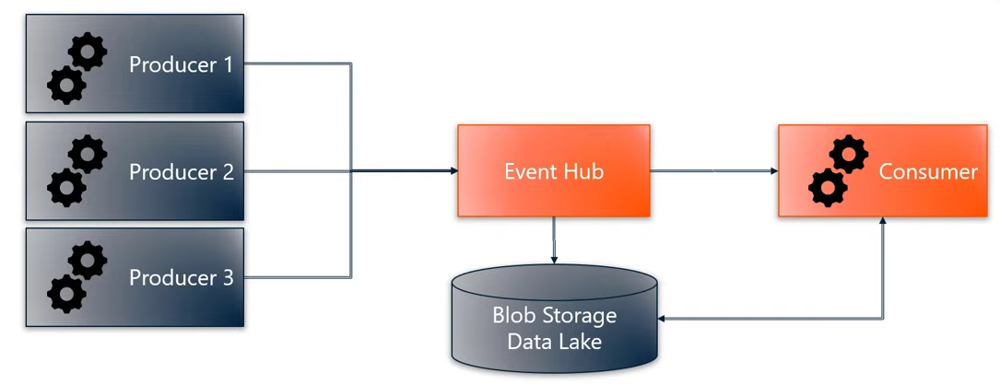

# EventHubs & .NET SDK

*The notes below were taken from the official Microsoft documentation page *[Features and terminology in Azure Event Hubs](https://learn.microsoft.com/en-us/azure/event-hubs/event-hubs-features)*.*

## Azure Event Hub

[Azure Event Hub](https://docs.microsoft.com/en-us/azure/event-hubs/event-hubs-about#main)  is a big data streaming platform and event ingestion service. It can receive and process millions of events per second.

The Event Hub routes live data from a data producer (publisher) to one or many data consumers (subscribers). The focus of Event Hub is to route **streaming data**

In addition to messages being streamed to all consumers, messages can also be stored. Typically messages are stored within an Azure service such as blob storage or data lake (more on this later).

> For overview of what is an EventHub and its terminology, refer to:
> 
> - [**Features and terminology in Azure Event Hubs**](https://docs.microsoft.com/en-us/azure/event-hubs/event-hubs-features) 

<a href="https://www.youtube.com/watch?v=zm1XUTAa9sc"> Data flow through Event Hub being forwarded to a consumer and stored </a>&nbsp; Azure Event Hubs, Blaize Stewart.

### EventHub Partitions

Event Hubs organizes sequences of events sent to an event hub **into one or more partitions**. As newer events arrive, they're added to the end of this sequence.

> The Free Tier of the Azure IoT Hub uses 2 partitions by default.

A partition can be thought of as a "commit log". Partitions hold event data that contains:

- Offset,
- Body of the event,
- Sequence number (number in the stream sequence),
- User-defined custom properties,
- System properties,
	- Such as service-side timestamp at which it was accepted.

### Stream offsets

An _offset_ is the position of an event within a partition. This offset enables an event consumer (reader) to specify a point in the event stream from which they want to begin reading events.

You can specify the offset as a **timestamp or as an offset value**.

Consumers are responsible for storing their own offset values outside of the Event Hubs service.

### Message Checkpointing

It's possible to **save a "checkpoint" offset** within a partition. 

This checkpoint information needs to be stored somewhere. A typical location is an Azure Blob Storage or a fast cloud-based database.

For convenience, the Azure EventHub .Net SDK includes methods for storing and retrieving checkpoints from an Azure Blob Storage (more on this later).

## EventHub and IoT Hub

An **Azure IoT Hub is also an instance of an Azure EventHub**.

Default, Device to Cloud (D2C) messages to an Azure IoT Hub are exposed to external applications via the build-in endpoints. **The IoT Hub's endpoints behave the same way as a EventHub endpoint.**

> Therefore, the Azure EventHub SDK is used by an application or service to receive D2C messages sent to the IoT Hub.

For details on the difference between an IoT Hub and an Event Hub, see [Connecting IoT Devices to Azure: IoT Hub and Event Hubs](https://learn.microsoft.com/en-us/azure/iot-hub/iot-hub-compare-event-hubs).

## EventHub .NET SDK

Azure provides two distinct packages, each with their **respective classes** for reading EventHub Messages:

- `EventProcessorClient` included in the `Azure.Messaging.EventHubs.Processor` package.
	- Supports reading events from all partitions with the call-back methods `ProcessEventAsync` and `ProcessErrorAsync` (recommended for production).
	
- `EventHubConsumerClient` included in the `Azure.Messaging.EventHubs` package.
	- Supports reading events from a single partition with the method `ReadEventsFromPartitionAsync` (suitable for production).
	- Supports reading from all partitions with the method `ReadEventsAsync` (not recommended for production).

Below are the references for both packages mentioned above:

| Nuget Package                                                                                             | Overview                                                                                                                                                    | Reference                                                                                                                                                        | Samples |
| --------------------------------------------------------------------------------------------------------- | ----------------------------------------------------------------------------------------------------------------------------------------------------------- | ---------------------------------------------------------------------------------------------------------------------------------------------------------------- | ------- |
| [Messaging.EventHubs.Processor](https://www.nuget.org/packages/Azure.Messaging.EventHubs.Processor) | [Getting started: Event Processor](https://learn.microsoft.com/en-us/dotnet/api/overview/azure/messaging.eventhubs.processor-readme?view=azure-dotnet)  | [API Reference for Messaging.EventHubs.Processor](https://docs.microsoft.com/dotnet/api/azure.messaging.eventhubs?view=azure-dotnet) | [Samples for Messaging.EventHubs.Processor](https://github.com/Azure/azure-sdk-for-net/tree/main/sdk/eventhub/Azure.Messaging.EventHubs.Processor/samples) |        |
| [Messaging.EventHubs](https://www.nuget.org/packages/Azure.Messaging.EventHubs)                    |  [Getting Started: Event Hubs Client](https://learn.microsoft.com/en-us/dotnet/api/overview/azure/messaging.eventhubs-readme?view=azure-dotnet) | [API Reference for Messaging.EventHubs.Consumer](https://learn.microsoft.com/en-us/dotnet/api/azure.messaging.eventhubs.consumer?view=azure-dotnet)                            | [Samples for Messaging.EventHubs](https://github.com/Azure/azure-sdk-for-net/tree/main/sdk/eventhub/Azure.Messaging.EventHubs/samples)                     |

When going through the sample code, the following order is recommended:

1. `EventProcessorClient`
	1. [Sample01_HelloWorld.md](https://github.com/Azure/azure-sdk-for-net/blob/main/sdk/eventhub/Azure.Messaging.EventHubs.Processor/samples/Sample01_HelloWorld.md)
	2. [Sample04_ProcessingEvents.md](https://github.com/Azure/azure-sdk-for-net/blob/main/sdk/eventhub/Azure.Messaging.EventHubs.Processor/samples/Sample04_ProcessingEvents.md)

2. `EventHubConsumerClient`
	1. [Sample01_HelloWorld.md](https://github.com/Azure/azure-sdk-for-net/tree/main/sdk/eventhub/Azure.Messaging.EventHubs/samples)
	2. [Sample05_ReadingEvents.md](https://github.com/Azure/azure-sdk-for-net/tree/main/sdk/eventhub/Azure.Messaging.EventHubs/samples)

3. Run the "Quickstart" code [Read device-to-cloud messages](https://github.com/Azure-Samples/azure-iot-samples-csharp/tree/main/iot-hub/Quickstarts/ReadD2cMessages)

### Cancellation Tokens

Many of examples listed above make use of Cancellation Tokens to manage Tasks.

> To learn more about Cancellation Tokens, see:
> [How to use CancellationTokens to cancel tasks in the Azure SDK for .NET](https://devblogs.microsoft.com/azure-sdk/how-to-use-cancellationtokens-to-cancel-tasks-in-the-azure-sdk-for-net/)

## Connection String: Event Hub Endpoint

When you use Event Hubs SDKs or product integrations that are unaware of IoT Hub, you need an Event Hub-compatible endpoint and Event Hub-compatible name. You can retrieve these values from the portal as follows:

1.  Sign in to the [Azure portal](https://portal.azure.com) and navigate to your IoT hub.
    
2.  Select **Built-in endpoints** from the resource menu, under **Hub settings**.
    
3.  The **Built-in endpoints** working pane contains three sections:
    
    -   The **Event Hub Details** section contains the following values:
	    - **Event Hub-compatible name**
	    - **Consumer Groups**.
    
    -   The **Event Hub compatible endpoint** section contains the following values:
	    - **Shared access policy** (the default is `"$Default"`)
	    - **Event Hub-compatible endpoint**.
    
  
In the working pane, the **Event Hub-compatible endpoint** field contains a complete Event Hubs connection string that looks like the following example:

**Note that the default consumer group name is `"$Default"`** (might required including double quotes).

