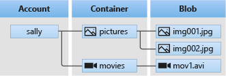

# Storage & Message Routing

## Storage Accounts

As one can imagine, there are many types of storage accounts in Azure. The ones we'll explore in this course are:

- Blob Storage (object storage).
- Table Storage (NoSQL database).

> To know more about the other storage services offered by Azure see **[Introduction to Azure Storage](https://docs.microsoft.com/en-us/azure/storage/common/storage-introduction#main)**.

### Blob Storage

Azure Blob storage is an object storage solution optimised for storing massive amounts of text or binary data.

Blob storage is designed for:

-   Serving images or documents directly to a browser.
-   Storing files for distributed access.
-   Streaming video and audio.
-   Writing to log files.
-   Storing data for backup and restore, disaster recovery, and archiving.
-   Storing data for analysis by an on-premises or Azure-hosted service.

Blob storage has the following structure:

**Storage account**: provides a unique address that includes your account name.

**Containers:** organises a set of blobs, similar to a directory in a file system.

**Blobs:** the file being stored.



<p class=img-info>
    <a href="https://docs.microsoft.com/en-us/azure/storage/blobs/storage-blobs-introduction"> Structure of Blob storage </a>&nbsp; Introduction to Azure Blob storage.
</p>

> For details on how to create a storage account see **[Create a storage account](https://docs.microsoft.com/en-us/azure/storage/common/storage-account-create?toc=%2Fazure%2Fstorage%2Fblobs%2Ftoc.json&tabs=azure-portal)**.

#### Data Lake Storage & Hierarchical Directories

By default, Blob storage has a flat file structure. This means that all blobs (files) sit at the same level inside the container.

Azure Data Lake Storage Gen2 is built on top of Blob storage, but offers additional features designed for big data analytics.

In particular, it offers hierarchical directory organisation at a marginal price increase.

> This simplifies storage retrieval and organisation so it will be the **preferred storage** option for IoT telemetry data.
>
> For more information see [**Introduction to Azure Data Lake Storage Gen2**](https://docs.microsoft.com/en-us/azure/storage/blobs/data-lake-storage-introduction).

Note: A Blob storage container is the Azure equivalent of an [Amazon S3 bucket](https://docs.aws.amazon.com/AmazonS3/latest/userguide/GetStartedWithS3.html).

### Using Blob storage w/ SDKs
As usual, Azure provides a SDK to interact with blob storage.

#### Python SDK
> Python SDK **[documentation overview](https://docs.microsoft.com/en-us/python/api/overview/azure/storage-blob-readme?view=azure-python)** for:
>- Getting started.
>- Key concepts.
>- Examples.

**Quick Links**
[Package (PyPI)](https://pypi.org/project/azure-storage-blob/) | [API reference documentation](https://aka.ms/azsdk-python-storage-blob-ref) | [Product documentation](https://docs.microsoft.com/en-us/azure/storage/) | [Samples](https://github.com/Azure/azure-sdk-for-python/tree/azure-storage-blob_12.11.0/sdk/storage/azure-storage-blob/samples)

#### .NET SDK
> .NET SDK **[documentation overview](https://docs.microsoft.com/en-us/dotnet/api/overview/azure/storage.files.datalake-readme?view=azure-dotnet)** for:
>- Getting started.
>- Key concepts.
>- Examples.

**Quick Links**
[Package (NuGet)](https://www.nuget.org/packages/Azure.Storage.Files.DataLake/) | [API reference documentation](https://docs.microsoft.com/en-us/dotnet/api/azure.storage.files.datalake) | [REST API documentation](https://docs.microsoft.com/en-us/rest/api/storageservices/datalakestoragegen2/filesystem) | [Product documentation](https://docs.microsoft.com/en-us/azure/storage/blobs/?toc=/azure/storage/blobs/toc.json)


Some notes on using the SDK:
- The Blob name is usually the path to the blob object relative to the container.
	- In the image below we have the container name on the left and the blob name on the right.


## Message Routing

It is possible to route messages to different end-points according to the type of message and the content of the message.


Message routing involves the following steps:

1. Create a custom endpoint (if not using the built-in  `events` endpoint which catches all events).
	- Choose between Storage or Event Hubs (the Service Buses are not covered in this course).
	- Create a Storage account if necessary.
2. Add a new route and associate it with the endpoint created above.
3. Set a routing query that will "catch" the message into the route.
	- The default routing query is `true`, which matches all messages.

 > See **[Azure Storage as a routing endpoint](https://docs.microsoft.com/en-us/azure/iot-hub/iot-hub-devguide-messages-d2c#azure-storage-as-a-routing-endpoint)** for details on how to to configure an endpoint with a storage account.
 > 
 > Additionally, you can follow the tutorial [**Set up message routing**](https://docs.microsoft.com/en-us/azure/iot-hub/tutorial-routing#set-up-message-routing) for a step by step guide.
 >- Skip the steps for the Service Buses (not covered in this course).


### Free Account Limitation
Unfortunately the free tier of the IoT Hub is limited to **only one additional endpoint** (see [Quotas and throttling](https://docs.microsoft.com/en-us/azure/iot-hub/iot-hub-devguide-quotas-throttling)).

In this lesson we will create and delete multiple endpoints to illustrate their capabilities.


### Routing Queries

A message event can be routed according to its type. Messages can be of the following types:

- device life-cycle events,
- device telemetry messages,
- device twin change events.

For telemetry messages, it's possible to query on:
- System properties,
- Application properties,
- Message body.

> See [**Create and read IoT Hub messages**](https://docs.microsoft.com/en-us/azure/iot-hub/iot-hub-devguide-messages-construct#system-properties-of-d2c-iot-hub-messages) for a list of message properties.


Consider the following message:

```json
{ 
  "message": { 
    "systemProperties": { 
      "contentType": "application/json", 
      "contentEncoding": "UTF-8",
      "iothub-connection-device-id": "myDevice-1"
      "iothub-message-source": "deviceMessages", 
      "iothub-enqueuedtime": "2017-05-08T18:55:31.8514657Z" 
    }, 
    "appProperties": { 
      "processingPath": "{cold | warm | hot}", 
      "verbose": "{true, false}", 
      "severity": 1-5, 
      "testDevice": "{true | false}" 
    }, 
    "body": "{\"Weather\":{\"Temperature\":50}}" 
  } 
} 
```

This message includes system properties, application properties and a body (payload).

To query on the application property `processingPath` and the system property `iothub-connection-device-id` we would write the following query:

```sql
processingPath = 'hot' AND $connectionModuleId = 'myDevice-1'
```

> See [**IoT Hub message routing query syntax**](https://docs.microsoft.com/en-us/azure/iot-hub/iot-hub-devguide-routing-query-syntax#main) for the query syntax and examples.


Note that in order for the message body to be stored in plain text, the following properties must be set on the message prior to sending the message:

```json
"contentType": "application/json", 
"contentEncoding": "UTF-8"
```

With the Python SDK, these properties would be set with:

```python
msg = Message(payload)
msg.content_encoding = 'utf-8'
msg.content_type = 'application/json'
```

## References

- [Introduction to Azure Blob storage](https://docs.microsoft.com/en-us/azure/storage/blobs/storage-blobs-introduction) by Microsoft.

- [Create Azure Data Lake Database, Schema, Table, View, Function and Stored Procedure](https://www.mssqltips.com/sqlservertip/5891/create-azure-data-lake-database-schema-table-view-function-and-stored-procedure/), by: [Ron L'Esteve](https://www.mssqltips.com/sqlserverauthor/329/ron-lesteve/ "author profile for Ron L'Esteve")

- Excellent introduction to Data Lake Storage:

<iframe width="560" height="315" src="https://www.youtube.com/embed/2uSkjBEwwq0" title="YouTube video player" frameborder="0" allow="accelerometer; autoplay; clipboard-write; encrypted-media; gyroscope; picture-in-picture" allowfullscreen></iframe>

- Examples of using Data Lake SDK with C#:
<iframe width="560" height="315" src="https://www.youtube.com/embed/JZWaWAU548g" title="YouTube video player" frameborder="0" allow="accelerometer; autoplay; clipboard-write; encrypted-media; gyroscope; picture-in-picture" allowfullscreen></iframe>

- Github Repo w/ Samples: [Azure Storage Files Data Lake client library for .NET](https://github.com/Azure/azure-sdk-for-net/tree/main/sdk/storage/Azure.Storage.Files.DataLake)
