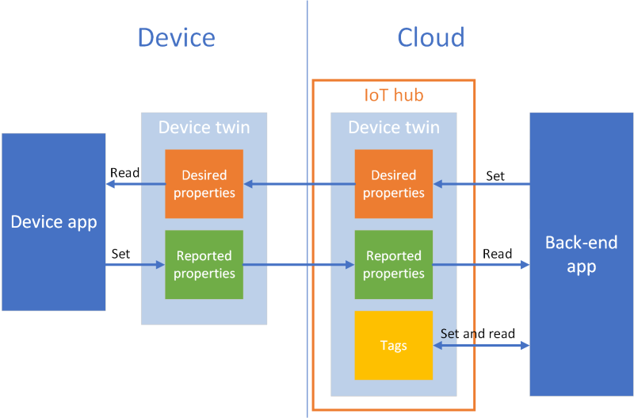
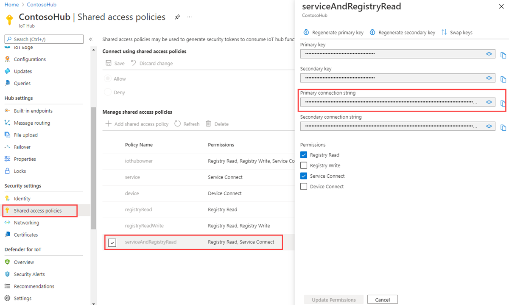

# Device Twins

> _Device twins_ are **JSON documents stored online**  that contain information about the state of a device, including metadata, configurations, and conditions.

Azure IoT Hub maintains a device twin for each device that you connect to IoT Hub.

**Device twins store device-related information that:**

-   Contains device metadata from your solution back end.    

-   Reports current state information such as available capabilities and conditions.

-   Synchronizes the state of long-running workflows, such as firmware and configuration updates, between a device app and a back-end app.


Note that **Device Twins are not appropriate for high-frequency communication** such as sending telemetry data from device to cloud. For this, use D2C messages.

 
## Device Twin Anatomy

The device twin JSON document has the following structure:

### Device identity properties

- Read-only properties from the corresponding device identity.

### Tags

- The solution back end can read from and write to. Tags are not visible to device apps.

### Desired properties

- Used along with reported properties to synchronize device configuration or conditions.
- **The solution back end can set desired properties, and the device app can read them.**
- The device app can also receive notifications of changes in the desired properties.
   
### Reported properties

- Used along with desired properties to synchronize device configuration or conditions. **The device app can set reported properties, and the solution back end can read and query them.**
   


<p class=img-info>
    <a href="https://docs.microsoft.com/en-us/azure/iot-hub/iot-hub-devguide-device-twins"> Structure of a Device Twin Json document </a>&nbsp; Understand and use device twins in IoT Hub.
</p>

> Notice how the back-end has **read/write access** to the *Desired* properties but only has **read access** to the *Reported* properties.
> 
> The inverse is true for the device app.


The following example shows a device twin JSON document:

```json
{
    "deviceId": "devA",
    "etag": "AAAAAAAAAAc=", 
    "status": "enabled",
    "statusReason": "provisioned",
    "statusUpdateTime": "0001-01-01T00:00:00",
    "connectionState": "connected",
    "lastActivityTime": "2015-02-30T16:24:48.789Z",
    "cloudToDeviceMessageCount": 0, 
    "authenticationType": "sas",
    "x509Thumbprint": {     
        "primaryThumbprint": null, 
        "secondaryThumbprint": null 
    }, 
    "version": 2, 
    "tags": {
        "$etag": "123",
        "deploymentLocation": {
            "building": "43",
            "floor": "1"
        }
    },
    "properties": {
        "desired": {
            "telemetryConfig": {
                "sendFrequency": "5m"
            },
            "$metadata" : {...},
            "$version": 1
        },
        "reported": {
            "telemetryConfig": {
                "sendFrequency": "5m",
                "status": "success"
            },
            "batteryLevel": 55,
            "$metadata" : {...},
            "$version": 4
        }
    }
}
```


## High-level Flow

The use of Device Twins typically involves the back-end application trying to update the state of a device.

In this case we have the following information flow:


1. A desired property is set by a back-end application into the IoT Hub.
2. The desired property is read by a device.
3. The device processes the desired property.
4. The device sets a reported property into the IoT Hub.
5. The device's reported property is read by the back-end application.
 
> Notice that a tag can be set by a back-end application and is never sent to the device. Tags are used to organize and query devices.



<p class=img-info>
    <a href="https://docs.microsoft.com/en-us/azure/iot-hub/tutorial-device-twins"> Information flow for a desired property change from a back-end app </a>&nbsp; Tutorial: Configure your devices from a back-end service.
</p>

## Desired Properties Example

Consider the property `telemetryConfig` which is used to configure telemetry collection on the device.

### Information Flow

**Step 1:** The solution back-end sets the desired property with the desired configuration value. Below is the portion of the document with the desired property:

```json
"desired": {
    "telemetryConfig": {
	    "sendFrequency": "5m"
    },
	... other properties and metadata if applicable ...
},
```


**Step 2a:** If the device is connected, it is notified of the change immediately.

**Step 2b:** If the device is not connected, it must follow the [device reconnection flow](https://docs.microsoft.com/en-us/azure/iot-hub/iot-hub-devguide-device-twins#device-reconnection-flow) to receive the full desired properties document and to subscribe to new notifications.

**Step 3:** The device parses the desired property and triggers an action according to the application logic.

**Step 4:** The device reports the updated configuration as a reported property (or an error condition using the `status` property). Below is the portion of the document with the reported property:

```json
"reported": {
    "telemetryConfig": {
        "sendFrequency": "5m",
        "status": "success"
    }
    ... other properties and metadata if applicable ...
}
```

**Step 5:** The back-end reads and tracks the results of the configuration operation. 

> Note that a back-end service can set and track device twin properties across many devices at once by [querying](https://docs.microsoft.com/en-us/azure/iot-hub/iot-hub-devguide-query-language) device twins (more on querying later).


### Device Implementation

> An excellent tutorial is provided in [Get started with device twins (Python) - Create the device app](https://docs.microsoft.com/en-us/azure/iot-hub/iot-hub-python-twin-getstarted#create-the-device-app)
> 
> Additionally, there are two examples in the Github repository:
> *azure-iot-sdk-python/azure-iot-device/samples/*[*sync-samples*](https://github.com/Azure/azure-iot-sdk-python/tree/main/azure-iot-device/samples/sync-samples)
> - [get_twin.py](https://github.com/Azure/azure-iot-sdk-python/blob/main/azure-iot-device/samples/sync-samples/get_twin.py "get_twin.py")
> - [update_twin_reported_properties.py](https://github.com/Azure/azure-iot-sdk-python/blob/main/azure-iot-device/samples/sync-samples/update_twin_reported_properties.py "update_twin_reported_properties.py")

#### Implementation Summary

1. Install the Azure IoT Hub Device SDK for Python.

```bash
pip install azure-iot-device
```

2. Import the class `IoTHubDeviceClient`.

```python
from azure.iot.hub import IoTHubDeviceClient
```

3. Instantiate a `IoTHubDeviceClient` from the Device connection string and connect to the IoT Hub.

```python
device_client = IoTHubDeviceClient.create_from_connection_string(conn_str)
device_client.connect()
```

4. Define a callback function for newly received Device Twin updates (patches).

```python
def twin_patch_handler(twin_patch):
    print(f"Twin patch received: {twin_patch}")
    
device_client.on_twin_desired_properties_patch_received = twin_patch_handler
```

5. Get the Device Twin document from the device instance and parse it if connecting for the first time (see the [device reconnection flow](https://docs.microsoft.com/en-us/azure/iot-hub/iot-hub-devguide-device-twins#device-reconnection-flow)).

```python
twin = device_client.get_twin()
```

6. **Parse your twin update** by inspecting the requested properties.

> This is were the magic happens 🧙
> 
> ⚠ Remember that any property starting with "$" is set by Azure. You cannot set or modify them. Trying to do so will result in an error.

7. Prepare your Reported Properties dictionary and send it to the IoT Hub

```python
reported_patch = {"telemetry_interval": 20}
device_client.patch_twin_reported_properties(reported_patch)
```

8. Disconnect the client.

```python
device_client.shuthdown()
```


### Back-end Implementation

> An excellent tutorial is provided in [# Get started with device twins (.NET) - Create a service app](https://learn.microsoft.com/en-us/azure/iot-hub/device-twins-dotnet#create-a-service-app-that-updates-desired-properties-and-queries-twins)

#### Shared Access Policy

The connection string required for the Device Twins back-end is specific to a shared access policy that has the permissions to:

- *Registry Read*
- *Service Connect*

>This is not your Event Hub compatible endpoint connection string.




## References

Most of the content in this lesson was extracted from:
- [Understand and use device twins in IoT Hub](https://docs.microsoft.com/en-us/azure/iot-hub/iot-hub-devguide-device-twins) by Microsoft Docs.
- [Get started with device twins (Python)](https://docs.microsoft.com/en-us/azure/iot-hub/iot-hub-python-twin-getstarted) by Microsoft Docs.


### Video Reference

<iframe width="560" height="315" src="https://www.youtube.com/embed/D3LWBFegqF8" title="YouTube video player" frameborder="0" allow="accelerometer; autoplay; clipboard-write; encrypted-media; gyroscope; picture-in-picture" allowfullscreen></iframe>
