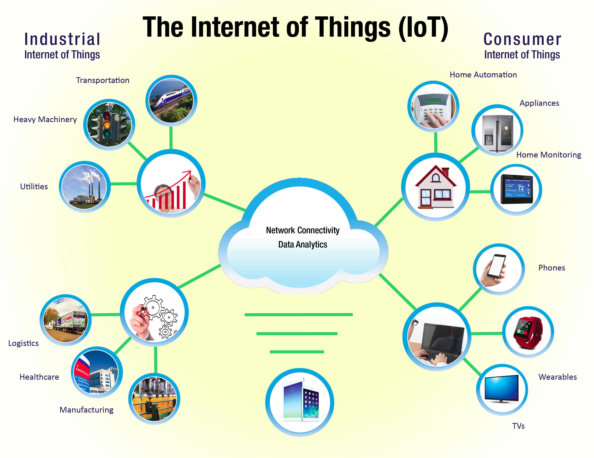
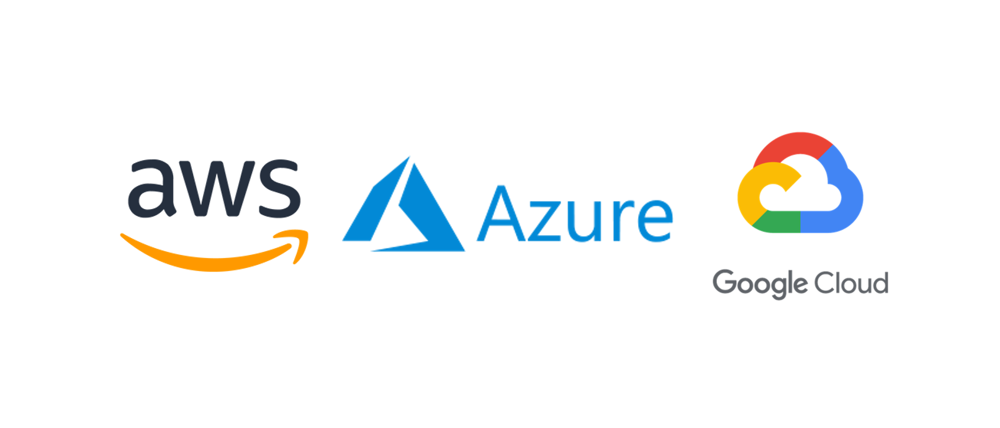

# Intro to the Internet of Things

Image: © Irina Strelnikova / Adobe Stock

## What's the Internet of Things?

The internet of things (IoT) is a comprised of equipment, machines, products, and devices that are connected to the cloud and periodically collect, send and/or receive data.

> Internet of Things (IoT) refers to the **entire network** of:
> 
> - physical devices,
> - tools,
> - equipment, and
> - smart objects
> 
> These objects have the capability to **collect and share data** about:
> 
> - how they are used
> - the environment around them

## Why collect all this data?

By analysing the data collected by these connected objects, users and organisations can make informed decisions in near real-time and automate tightly integrated processes.

Decision making that is based on little or out-dated data can be skewed or biased. The real-time information from devices that are "in the field" can address this problem.

This data can create quick feedback loops for automation. Data from one object can trigger actions or control several other objects with timing and precision that could not be achieved by humans.  

## IoT Examples

The use of IoT can be organised in two fields of application: **Industrial and Consumer IoT**.

[The Internet of Things and its Benefit to U.S. Water Customer](https://www.kuritaamerica.com/the-splash/the-internet-of-things-and-its-benefit-to-us-water-customers) - kuritaamerica.com

### Consumer IoT
Some examples of consumer IoT are:
- **Home Security**: Sensors, alarms, cameras, lights, and microphones provide 24/7 security and surveillance. All of which can be controlled from a smart phone.
- **Smart Home**: Smart lighting, heating and sound systems can be automated to detect human present or receive instructions remotely. Voice Assistants can also control house appliances or and provide information.
- **Wearables:** Smartwatches and fitness trackers can monitor blood pressure or heart rate, and physical activity and suggest workouts, breaks or medical assistance.
- **Appliances:** Smart fridges can keep track of food quantities and expiry dates and create shopping lists accordingly. Smart outlet plugs can measure electrical consumption and turn other appliances on/off.

### Industrial IoT

Most people tend to first thing of IoT as consumer devices. However, their main value added happens in industrial applications. 

<a href="https://medium.com/@jaydev_21091/how-industrial-internet-of-things-are-impacting-our-lives-8af4163530ce">How Industrial Internet of Things are impacting our lives</a> by Bluechip Infocorp Pvt Ltd via Medium.

Some examples of Industrial IoT:

- **Equipment Maintenance:** [Rolls-Royce’s Total Care](https://www.rolls-royce.com/media/press-releases/2016/11-07-2016-rr-takes-totalcare-digital-with-microsoft-and-singapore-airlines.aspx) provides a suite of predictive maintenance and repair services for its jet engines, including monitoring engine health, and modifying engines to increase reliability and durability.

- **Farming:** [John Deere](https://www.iotforall.com/ces-2021-john-deere) is building intelligence into its large tractors and sprayers through sensors that make the machines into mobile platforms capable of self-driving.

- **Heavy Machinery & Transportation:** [Rio Tinto](https://www.iotforall.com/iot-is-reshaping-heavy-industry), a global mining company uses a remote command center to orchestrate the actions of huge drills, excavators, trains, and trucks across multiple mining sites.

- **Renewable Energies:** [Iberdrola and Siemens](https://www.nsenergybusiness.com/features/iot-wind-power/) are using IoT to optimize the operation and maintenance of offshore wind power farms, the lifetime extension of wind turbines and the reducing the cost of energy.

- **Facilities Management:** Monitoring of buildings, infrastructure, and other spaces, allow to improve energy efficiency, space utilization, productivity, and safety. These insights may help:
	- save money by automating lighting or optimizing heating and cooling cycles.
	- Increase employee or occupant satisfaction by keep equipment running or ensuring that supplies are stocked.

### High-level Components of an IoT System

An IoT system is compromised of four main conceptual components:

1.  **Sensors:** enables the devices to collect data from the environment surrounding the device (eg. velocity, GPS coordinates, temperature, etc...).
2.  **Connectivity:** successively the data collected is sent to the cloud (through either WiFi or Bluetooth connection).
3.  **Data Processing:** once the data is received by the cloud infrastructure, it can then be processed (eg. check if the data received adhere to the requirements and if its not alert the user).
4.  **User Interface:** Once the data is processed, the results are then given to the and user.

[An Introduction to the Internet of Things](https://www.freecodecamp.org/news/introduction-to-iot-internet-of-things/) by Pier Paolo Ippolito via freeCodeCamp.org

In this course we will learn how to setup, connect and control each one of these components.

## IoT Cloud Service Providers

Since IoT objects typically move around, connectivity and data collection need to happen over wide geographical areas.

Most companies do not want to deal with setting-up the physical infrastructure and software required to have this level of distributed connectivity and reliability (servers, databases, backup systems, networking, container orchestration, etc).

It is typically far more practical and cost-effective to use the services of an established IoT Cloud Service Provider.

The three main Cloud Service Providers in the IoT space are: 
- **Amazon Web Services (AWS)**
- **Microsoft Azure**
- **Google Cloud**

There are many other Cloud providers such as [IBM Cloud IoT](https://www.ibm.com/cloud/internet-of-things) and [Oracle IoT](https://www.oracle.com/internet-of-things/).

> In this course we will focus on **Microsoft Azure**.
> However, all three platforms offer similar functionality.

## References
[What is IoT](https://azure.microsoft.com/en-us/overview/internet-of-things-iot/what-is-the-internet-of-things/) by Microsoft Azure.
[How Industrial Internet of Things are impacting our lives](https://medium.com/@jaydev_21091/how-industrial-internet-of-things-are-impacting-our-lives-8af4163530ce) by Bluechip Infocorp Pvt Ltd via Medium.
[An Introduction to the Internet of Things](https://www.freecodecamp.org/news/introduction-to-iot-internet-of-things/) by Pier Paolo Ippolito via FreeCodeCamp Blog.
