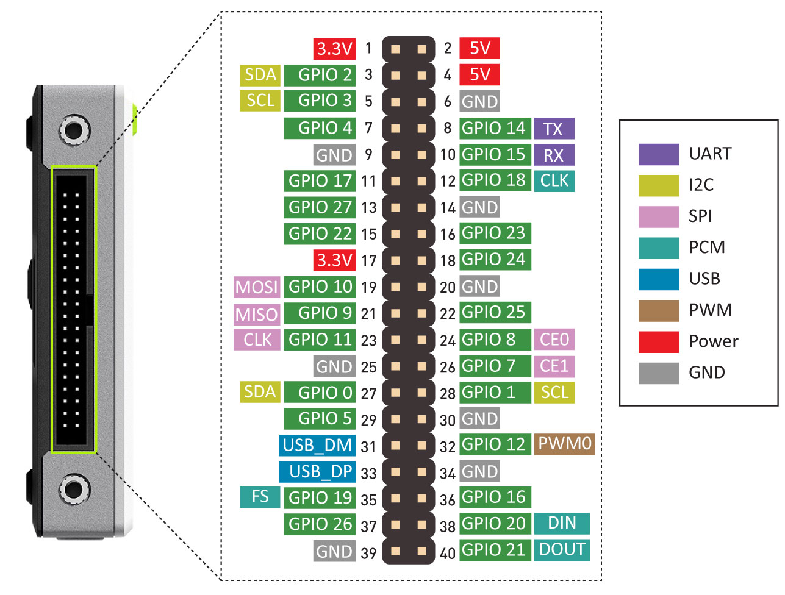

# GPIOs: Inputs & Outputs

## Intro to Pi's GPIOs 🥧

The Raspberry Pi can read and generate digital signals using **General Purpose Input and Output (GPIO)** pins.

Any of the GPIO pins can be designated (in software) as an input or output pin and used for a wide range of purposes.

	<a href="https://www.raspberrypi.com/documentation/computers/os.html#gpio-and-the-40-pin-header"> GPIO and the 40-pin headers of the Raspberry Pi </a>&nbsp; - Official docs, Raspberry Pi Foundation.

The reTerminal exposes the same 40-pin header as the Pi on it's side:

	<a href="https://wiki.seeedstudio.com/reTerminal/#pinout-diagram"> GPIO and pin diagram of the reTerminal </a>&nbsp; - reTerminal Official Wiki, Seeed.

### Voltages

Two 5V pins and two 3V3 pins are present on the board, as well as a number of ground pins (0V), which are unconfigurable. The remaining pins are all general purpose 3V3 pins, meaning outputs are set to 3V3 and inputs are 3V3-tolerant.

### Outputs

A GPIO pin designated as an output pin can be set to high (3V3) or low (0V).

### Inputs

A GPIO pin designated as an input pin can be read as high (3V3) or low (0V).

**We will learn how to use the GPIOs in a future lesson.**

### Digital Communication Protocols

In addition to simple input and output devices, the GPIO pins can be used with a variety of alternative functions and digital communication protocols.

These digital communication protocols are:

- **PWM** (pulse-width modulation)
- **SPI** (serial peripheral interface)
- **I2C** (inter-integrated circuit)
- **Serial**
- **PCM** (pulse-code modulation)

Some digital functions are available on all pins, others on specific pins.

### Sorry, No Analog

> **The Raspberry Pi does not have an ADC.** 
> 
> In order to process analog electrical signals an external ADC must be used.

**Hat to the Rescue**

In this course we will use the integrate ADC of the [Grove Base Hat](https://wiki.seeedstudio.com/Grove_Base_Hat_for_Raspberry_Pi/) for the Raspberry Pi.

 

	<a href="https://wiki.seeedstudio.com/Grove_Base_Hat_for_Raspberry_Pi/"> Seeed's Grove Base Hat for the Raspberry Pi has an integrated ADC </a>&nbsp; Base Hat official wiki, Seeed.

[Pi HATs](https://www.tomshardware.com/best-picks/best-raspberry-pi-hats) is the term for expansion boards for the Raspberry Pi.

> Seeed's [Grove Base Hat](https://wiki.seeedstudio.com/Grove_Base_Hat_for_Raspberry_Pi/) for the Raspberry Pi has **4 connectors with integrated ADC**.
> 
> Each ADC connector has **12-bit resolution**.

In addition to the 4 ADC connectors, the Base Hat also exposes the original 40-pin header and other digital connectors.

	<a href="https://wiki.seeedstudio.com/Grove_Base_Hat_for_Raspberry_Pi/"> Specialized connectors of the Raspberry Pi available via the Base Hat </a>&nbsp; Base Hat official wiki, Seeed.

