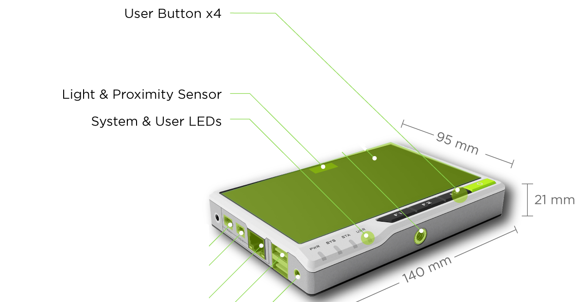

# Reading Built-in Sensors

## reTerminal connection w/ hostname

During labs 1 and 2 you connected to the reTerminal via SSH using its IP address.

> It's also possible to connect to the reTerminal using it's default hostname: **raspberrypi.local**.

```bash
$ ping raspberrypi.local
PING raspberrypi.local (192.168.2.128) 56(84) bytes of data.
64 bytes from raspberrypi (192.168.2.128): icmp_seq=1 ttl=64 time=90.0 ms
64 bytes from raspberrypi (192.168.2.128): icmp_seq=3 ttl=64 time=147 ms
^C
--- raspberrypi.local ping statistics ---
3 packets transmitted, 3 received, 0% packet loss, time 2003ms
rtt min/avg/max/mdev = 90.028/120.890/147.486/23.650 ms
```

Note that this method only works if your device is the only `raspberrypi.local` in the network. Otherwise you might be connecting to a different device.

This will save you from having to look-up the reTerminal's IP address if you are at home.


## Package Managers

### Apt: Debian Package Manger

So far we have updated, upgraded and installed some packages in the Raspberry Pi OS.

> The **Raspberry Pi OS is a modified version of Debian Linux**.
> Debian is the base Linux system from which Ubuntu, Mint, PopOS, and many other distributions are made.

For example, the commands:

```bash
sudo apt update         // Update all packages within the same major version (eg v2.1 -> v2.2)
sudo apt full-upgrade   // Upgrade major versions of all packages (eg. v2.1 -> v3.0)
sudo apt install code   // Install the package VS Code
```


The command `apt` is the default package manager of Debian.

> A **package manager** is a software tool responsible for automating the installation, removal, configuration and removal of computer programs.


The same tasks could technically be done manually, however, it is very time consuming and error prone. For example, tracking package dependencies and compatibility with the current system. 

Note: `apt` is a newer package manager API meant to replace the older API  `apt-get`. However, they both accomplish the same. See [Debian docs](https://www.debian.org/doc/manuals/debian-handbook/sect.apt-get.en.html) for details.


### Pip: Python Package Manager

[`pip`](https://pip.pypa.io/en/stable/) is python's own package manager, which is independent from `apt`. 

To use it for python 3, call the command `pip3`

```bash
pip3 install emoji
```

This will install the a python library emoji which will create emoji from text descriptions.

> Note: it is not recommended that you run `pip` as `sudo` because `pip` could overwrite system files that are managed by `apt`.


Once a python module has been installed, it is available to be imported in your python script:

```python
import emoji

message = emoji.emojize('Howdy :sun_with_face:')
print(message)
```

Output:
```bash
Howdy 🌞
```

It is also possible to give an alias to the newly imported module:
```python
import emoji as em

message = em.emojize('Howdy :sun_with_face:')
print(message)
```

Finally, you can import only a specific function and give it an alias:
```python
from emoji import emojize as emz
message = emz('Howdy :sun_with_face:')
print(message)
```


## Reading sensor data from Linux
*This section is based on the official documentation for the reTerminal: [Hardware and Interfaces Usage](https://wiki.seeedstudio.com/reTerminal-hardware-interfaces-usage/#3-user-programmable-leds)*

> In Linux, everything is a file that can be read and/or written.

For example, keyboard inputs and communication over web-sockets are all read as a file.

The reTerminal has 3 programmable LED's and a light sensor that can be controlled like a regular file



### Programmable LEDs

There are 3 programmable LEDs in the reTerminal:
- **STA** light can be turned on as **red or green**.
- **USR** light can only be turned on as **green**.


The lights can be controlled at the OS level in the following way:

1. Enter the following directory

```bash
cd /sys/class/leds
```

2. Enter the following directory to control the **Green Color USR LED**

```bash
cd usr_led0
```

3. Enable root account privileges

```bash
sudo -i
```

Your shell should now display `root@raspberrypi:~# `

> **Note:** We'll run the next command as root because the file we want to write to belongs the system rather than to the user `pi`.
> 
> We are about to modify a system file located in `/sys/class/leds/urs_led0`

4. Turn on the LED with maximum brightness

```bash
echo 255 > brightness
```

**Note:** You can enter values from 1 - 255 to adjust the brightness levels

5. Turn off the LED

```bash
echo 0 > brightness
```

Similarly, you can control  `usr_led1` and `usr_led2`.


### Luminosity Sensor

The digital light sensor can read the surrounding light levels.

1. Enter the following directory

```bash
cd /sys/bus/iio/devices/iio:device0
```

2. Read the following file to obtain the light intensity value in **Lux**

```bash
cat in_illuminance_input 
```

Output:
```bash
pi@raspberrypi:/sys/bus/iio/devices/iio:device0 $ cat in_illuminance_input 
2719
```

**Note:** We don't need to be root to read this file. Its permissions are set to let all users read it, even-though it belongs to the root user:

```bash
rw-r--r-- 1 root root 4096 Jan 30 22:16 in_illuminance_input
```

## Python Library for reTerminal

Seeed Studio provided a python library to access most of the sensors and actuators of the reTerminal.


Install the library `seeed-python-reterminal` (see official [Github repo](https://github.com/Seeed-Studio/Seeed_Python_ReTerminal)) using `pip`:

```bash
pip3 install seeed-python-reterminal
```

Now you can import it to a test script (eg. *buzz.py*)

```python
import seeed_python_reterminal.core as rt
import time

print("BUZZER ON")
rt.buzzer = True
time.sleep(1)

print("BUZZER OFF")
rt.buzzer = False
```

This will sound the buzzer of the reTerminal for 1 second.

To run the script:
```bash
sudo python3 buzz.py
```

Alternatively, first elevate your shell, then execute the script normally:
```bash
pi@raspberrypi:~ $ sudo -i
root@raspberrypi:~# python3 buzz.py
```

> **Note:** this library is simply a wrapper to the OS operations we did in the previous section.
> Some files need to be accessed by python as root. In this case, it is necessary to run `sudo -i` **before running** the python script.


See the official `seeed-python-reterminal` [Github repo](https://github.com/Seeed-Studio/Seeed_Python_ReTerminal) for API reference on how to control:
- LED's
- Accelerometer
- Programmable Buttons
- Light Sensor (requires manual updating)

