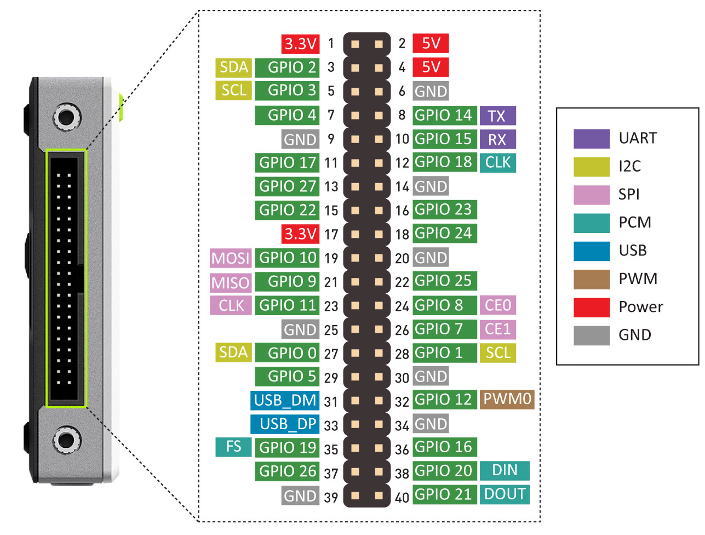

# Analog & Digital Signals

We will use analog and digital signals to communicate with sensors.

This section briefly compares these two types of signals and illustrates how we might encounter while using IoT hardware.

To compare analog and digital signals, let's look at how we can track 3 different sources of information:

- Temperature
- Sound
- Electricity (voltages)

## Analog: the natural world

We live in an analog world. Most of the naturally occurring events that we experience happen in an analog form.

> Analog signals varies continuously in time and amplitude.
> 
> This means that changes happen over a range of values with infinite "in between" steps. 

For example, the following events have an infinite number of transitions. It only depends on how accurately you can track them:

- The colors in a rainbow.
- The position of a swinging pendulum.
- The exact time of the day.

### Temperature

The A/C and heating systems in a house are typically activated once the temperature reaches some minimum and maximum values.

The chart below is tracking the temperature in a room as the A/C and heating systems are activated over a few days.

	<a href="https://info.sparkfun.com/hubfs/Poster%20Downloads/Analog%20vs%20Digital/Concept%20Poster%20Analog%20vs%20Digital%20WEB.pdf"> Temperature changes over time </a>&nbsp; Adapted from poster: Analog and Digital Signals by Digikey.

Let's say the maximum temperature reached in the room is 30C and the minimum temperature is 15C. A person in the room would have observed every possible temperature in between that range (15.01C, 15.0101C, 15.0102C, 15.01021C, etc).

The change in temperature produces analog information since it is changing over an infinite range of values.

### Sound

Sound is also an example of an analog signal.

When a volume of air is displaced quickly, air molecules are compressed against each other creating a high-pressure region. The high pressure region expands and compresses the air in the neighbouring area. Sound can travel thanks to this "chain effect".

> By observing how the air pressure changes over time, we can draw a sound wave.
>
> This is how speakers and microphones interact with air to generate sound.

	<a href="http://resource.isvr.soton.ac.uk/spcg/tutorial/tutorial/Tutorial_files/Web-basics-sound.htm"> Sound waves travelling through air </a>&nbsp; - Waves and Acoustics Animations by isvr.

Sound waves are also an example of an analog signal because the amplitude of the wave transitions through the entire range of possible values between the Min and Max.

### Analog Signals Graphs

A signal varies over time. It's helpful to plot it on a graph where time is plotted on the horizontal, _x_-axis, and the value being tracked on the vertical, _y_-axis.

Looking at a graph of a signal is usually the easiest way to identify if it's analog or digital.

> When dealing with electricity we track voltage levels (amplitude).
> 
> A time-versus-voltage graph of an analog signal should be **smooth** and **continuous**.

While these signals may be limited to a **range** of maximum and minimum values, there are still an infinite number of possible values within that range.

For example, the analog voltage coming out of your wall socket oscillates between -120V and +120V. As you increase the resolution more and more, you discover an infinite number of values that the signal can actually be (64.4V, 64.42V, 64.424V, and other increasingly precise values).

## Digital: discrete values

Digital signals are discrete, which means that at any given moment, the signal strength must be represented by a integer number. There are no half numbers.

Most commonly, digital signals will be one of **two values**, a high voltage and a low voltage (eg. either 0V or 5V).

Timing graphs of these signals look like **square waves**.

	<a href="https://learn.sparkfun.com/tutorials/analog-vs-digital/all"> 0 to 5 volt "pulses" forming a square ware </a>&nbsp; - Analog vs. Digital by Digikey.

A digital signal might be a discrete representation of an analog waveform.

Viewed from afar, the wave function below may seem smooth and analog, but when you look closely there are tiny discrete **steps** as the signal tries to approximate analog values.

	<a href="https://learn.sparkfun.com/tutorials/analog-vs-digital/all"> Oscillating voltage from -120V to 120V represented as a digital signal </a>&nbsp; - Analog vs. Digital by Digikey.

The number of **discrete steps** that a digital signal can use depends on how many bits are available for each recorded value. This is also called **bit resolution** (see *Sampling* below).

For example, if a data point can only use one bit of definition, then it can only track on/off states, resulting in the red square wave seen above.

However, if a data point can use 8 bits to store a value, then it can represent a value ranging from 0 to 255 (see the green sinusoidal voltage wave above).

## Analog to Digital Conversion (ADC)

If most natural events are analog, how do we represent them in digital format?
For example, if audio is analog, how can we get a computer to play music?

> An **analog to digital converter (ADC)** is a device that can read a analog signal and generate a digital representation of this signal.

ADC's are specific to the type of analog signal they are trying to read (sound, voltage, temperature, light, etc).

Referring to the room temperature example used earlier, if we used a digital thermometer to record the temperature, our graph might look like the following:

	<a href="https://info.sparkfun.com/hubfs/Poster%20Downloads/Analog%20vs%20Digital/Concept%20Poster%20Analog%20vs%20Digital%20WEB.pdf"> Temperature represented as a digital reading </a>&nbsp; Poster: Analog and Digital Signals by Digikey.

In the example above, a digital temperature reading was taken **every 3hr**.

> The digital signal representation of the temperature **is not smooth or accurate**. 
> 
> However, depending on the application **it might be sufficient**.

To make the signal smoother or more representative of the real analog signal we need to take samples more regularly (eg. every 1min).

The process of reading an analog signal over time to generate its digital representation is called **sampling.**

## Sampling

Sampling is the process of inspecting the value of an analog signal at regular time intervals.

When an ADC is sampling an analog signal, there are two variables that will characterize the digital output:

- Sampling rate.
- Bit resolution.

### Sampling rate

The time between samples is the **sample period** (T, in seconds), and the number of samples taken per second is the **sample frequency or sample rate** (fs, in samples/second or Hz).

Basically, **sampling is taking snap-shot values of the analog signal at regular time intervals.** 

	<a href="https://www.usna.edu/ECE/ec312/Lessons/wireless/EC312_Lesson_20_Analog_to_Digital_Course_Notes.pdf"> Sample period and fequency for an electric signal </a>&nbsp; - US Naval Academy.

As you can imagine, the higher the sample rate, the more accurate the digital signal is.

	<a href="https://www.usna.edu/ECE/ec312/Lessons/wireless/EC312_Lesson_20_Analog_to_Digital_Course_Notes.pdf"> Same signal sampled with different sample rates </a>&nbsp; - US Naval Academy.

### Encoding & Bit resolution

Encoding is the process of mapping the sampled analog signal value to discrete binary numbers (digital information).

> ADC devices are characterized by the **number of bits available** to represent a signal.

For example, consider an audio signal coming into your computer. The signal oscillates between -1 and 1 volt (typical range for your audio input jack).

If the sampling period is every 0.5 milliseconds (0.0005 secs), the sample frequency is 1/0.0005s = 2000 Hz (times per second).

Assuming the ADC has a resolution of 3 bits, all voltage values (-1V to 1V) must be represented with at most 3 bits, or 2^3 = 8 unique values (0 is a unique value).

	<a href="https://www.usna.edu/ECE/ec312/Lessons/wireless/EC312_Lesson_20_Analog_to_Digital_Course_Notes.pdf"> Voltage signal between -1V and 1V converted to digital with a 3 bit resolution </a>&nbsp; - US Naval Academy.

In this case:
- 000 is assigned to the voltages from -0.75 V to -1.0 V,
- 001 is assigned to the voltages from -0.5 V to -0.74999 V,
- 010 is assigned to the voltages from -0.25 V to -0.49999 V,
- and so on.

The binary representation of the above signal is:

110 101 100 011 011 100 110 110 100 010 000 000 001

If the sampling is happening 2000 times per second (Hz) and for every sample we generate 3 bits, we are generating 2000 x 3 bits = 6000 bits/sec of information. This is also know as the bitrate.

If a song of 3 minutes is sampled with the same specs, how big will this file be in kB?

What is the [bitrate of music on Spotify](https://www.tunefab.com/tutorials/spotify-bitrate.html)?

### Sensor voltages & bit resolution

IoT systems typically work with electrical signals encoded in voltage levels.

Microcontrollers are often used to process these signals because they often have an integrated ACD.

ADCs can vary greatly between microcontrollers. The ADC on the Arduino UNO (see previous lesson) is a 10-bit ADC meaning it has the ability to detect 1,024 (2^10) discrete analog levels. Some microcontrollers have 8-bit ADCs (2^8 = 256 discrete levels) and some have 16-bit ADCs (2^16 = 65,536 discrete levels).

## Intro to Pi's GPIOs 🥧

The Raspberry Pi can read and generate digital signals using **General Purpose Input and Output (GPIO)** pins.

Any of the GPIO pins can be designated (in software) as an input or output pin and used for a wide range of purposes.

	<a href="https://www.raspberrypi.com/documentation/computers/os.html#gpio-and-the-40-pin-header"> GPIO and the 40-pin headers of the Raspberry Pi </a>&nbsp; - Official docs, Raspberry Pi Foundation.

The reTerminal exposes the same 40-pin header as the Pi on it's side:

	<a href="https://wiki.seeedstudio.com/reTerminal/#pinout-diagram"> GPIO and pin diagram of the reTerminal </a>&nbsp; - reTerminal Official Wiki, Seeed.

### Voltages

Two 5V pins and two 3V3 pins are present on the board, as well as a number of ground pins (0V), which are unconfigurable. The remaining pins are all general purpose 3V3 pins, meaning outputs are set to 3V3 and inputs are 3V3-tolerant.

### Outputs

A GPIO pin designated as an output pin can be set to high (3V3) or low (0V).

### Inputs

A GPIO pin designated as an input pin can be read as high (3V3) or low (0V).

**We will learn how to use the GPIOs in a future lesson.**

### Digital Communication Protocols

In addition to simple input and output devices, the GPIO pins can be used with a variety of alternative functions and digital communication protocols.

These digital communication protocols are:

- **PWM** (pulse-width modulation)
- **SPI** (serial peripheral interface)
- **I2C** (inter-integrated circuit)
- **Serial**
- **PCM** (pulse-code modulation)

Some digital functions are available on all pins, others on specific pins.

**We will explore some of these protocols in future lessons**.

### Sorry, No Analog Pins

> **The Raspberry Pi does not have an ADC.** 
> 
> In order to process analog electrical signals an external ADC must be used.

In this course we will use the integrate ADC of the [Grove Base Hat](https://wiki.seeedstudio.com/Grove_Base_Hat_for_Raspberry_Pi/) for the Raspberry Pi.

 

	<a href="https://wiki.seeedstudio.com/Grove_Base_Hat_for_Raspberry_Pi/"> Seeed's Grove Base Hat for the Raspberry Pi has an integrated ADC </a>&nbsp; Base Hat official wiki, Seeed.

[Pi HATs](https://www.tomshardware.com/best-picks/best-raspberry-pi-hats) is the term for expansion boards for the Raspberry Pi.

> Seeed's [Grove Base Hat](https://wiki.seeedstudio.com/Grove_Base_Hat_for_Raspberry_Pi/) for the Raspberry Pi has **4 connectors with integrated ADC**.
> 
> Each ADC connector has **12-bit resolution**.

In addition to the 4 ADC connectors, the Base Hat also exposes the original 40-pin header and other digital connectors.

## Exercises

### Exercise 1
Considering the analog signal below. The signal is being sampled at 2Hz (2 times/sec) with a signed 4-bit resolution (we can represent the numbers -8 to +7).

What are the numbers being stored as the digital signal before they are converted to binary? What is the final binary representation of the signal?

## References
- [Analog vs. Digital](https://learn.sparkfun.com/tutorials/analog-vs-digital/all) by Sparkfun.
- [Lesson 20: Analog to Digital Conversion](https://www.usna.edu/ECE/ec312/), Course EC312, US Naval Academy.
- Lessons 4 and 5, Telecom course, Sandy Bultena.

### Video Reference

<iframe width="560" height="315" src="https://www.youtube.com/embed/64FSgQdWHrE" title="YouTube video player" frameborder="0" allow="accelerometer; autoplay; clipboard-write; encrypted-media; gyroscope; picture-in-picture" allowfullscreen></iframe>

<!-- 
## Diving Deeper

### Is digital better?

#### Noise: digital can handle it -->

