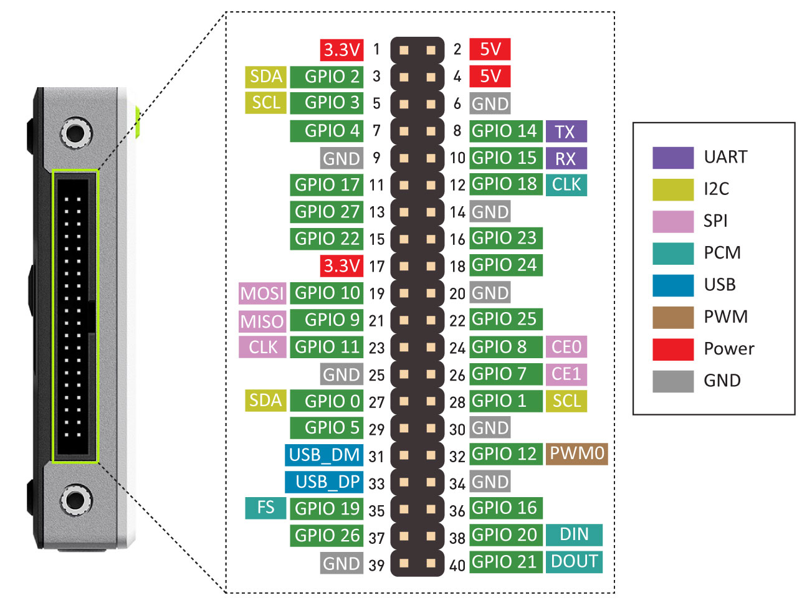
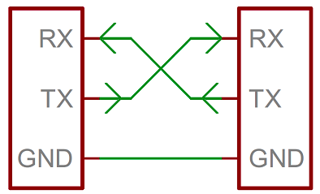
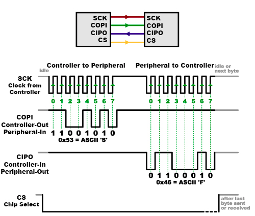
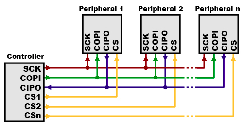

# Serial Protocols

We have previously seen that the Raspberry Pi and the reTerminal have several GPIO pins that can be set as digital inputs or outputs:


<p class=img-info>
	<a href="https://wiki.seeedstudio.com/reTerminal/#pinout-diagram"> GPIO and pin diagram of the reTerminal </a>&nbsp; - reTerminal Official Wiki, Seeed.
</p>

In addition to simple input and output signals, the GPIO pins can be used with a variety of specific digital communication protocols:

- **Serial**
- **SPI** (serial peripheral interface)
- **I2C** (inter-integrated circuit)
- **PWM** (pulse-width modulation)
- **PCM** (pulse-code modulation)


## Serial Communication

In order for two devices to exchange information, they must share a common communication protocol.

Serial interfaces stream their data, one single bit at a time. These interfaces can operate with as little as one wire (for unidirectional communication), however they typically use 2 to 4 wires.

Serial communication can be either: **synchronous** and **asynchronous**.

### Synchronous Serial

A synchronous serial interface always pairs its data line(s) with a clock signal, so all devices on a synchronous serial bus share a common clock.


<p class=img-info>
	<a href="https://learn.sparkfun.com/tutorials/serial-communication"> Serial interface unidirectionally transmitting one bit at every clock pulse </a>&nbsp; Serial Communication, Sparkfun.
</p>

> How many wires are used in the image above? Can information flow in both directions?

This makes for faster serial transfer, but it also requires at least one extra wire between communicating devices.

Examples of synchronous interfaces:
- SPI
- I2C
- USB (uses clock-synchronization)

### Asynchronous Serial

Asynchronous means that data is transferred **without support from an external clock signal**.

This transmission method minimizes wires and I/O pins, however, extra effort is put into reliably transferring and receiving data.

Asynchronous serial communication is typically intended for **only two devices** to communicate


<p class=img-info>
	<a href="https://learn.sparkfun.com/tutorials/serial-communication"> Wiring diagram for two devices communicating with the Serial protocol </a>&nbsp; Serial Communication, Sparkfun.
</p>

> This is the most common type of serial communication between devices.
> 
> **The term "Serial" is commonly used to refer to Asynchronous Serial**

In order to communicate reliably, both devices have to adhere to a number of rules such as: Data bits, Synchronization bits, Parity bits, and Baud rate.

For example, when using the serial monitor of the Arduino IDE, it's necessary to properly select the Baud Rate so that both the client device (the Arduino) and the host (your PC) know the exactly clock frequency of the serial communication.


<p class=img-info>
	<a href=#></a>&nbsp; Selecting the baud rate of the Arduino IDE's serial monitor.
</p>

## UARTs

A universal asynchronous receiver/transmitter (UART) is a block of circuitry responsible for implementing serial communication.

A UART converts multiple parallel digital lines into two serial lines: Transmission (Tx) and Receiving (Rx) lines.

> The Raspberry Pi has a built-in UART on GPIO14 (Tx) and GPIO15 (Rx).

The [python library pySerial](https://pyserial.readthedocs.io/en/latest/pyserial.html) can be used to send and receive serial data to and from the Raspberry Pi:

```python
import serial
ser = serial.Serial('/dev/ttyS0')  # open serial port (9600 default baud rate)
print(ser.name)         # check which port was really used
ser.write(b'hello')     # write a string
ser.close()             # close port
```

## Serial Peripheral Interface (SPI)

Serial Peripheral Interface (SPI) is commonly used to send data between microcontrollers and small peripherals (ei. shift registers, sensors, SD cards).

It uses separate clock and data lines, along with a select line to choose the device you wish to talk to.

The communication can happen between a **controller device** (controlling the terms of the communication) and one or multiple **peripheral devices**.

The following nomenclature is typically used:

- **SCK: Clock Signal**. Generated by the controller device.
- **COPI: Controller-Out Peripheral-In**. Information flows from controller to peripheral device.
- **CIPO: Controller-In Peripheral-Out**. Information flows from peripheral to controller.
- **CS: Chip Select**. Every peripheral device has a unique connection to the controller. The controller uses this line to enable (wake-up) the  peripheral when it wants to communicate by setting it low.


<p class=img-info>
	<a href="https://learn.sparkfun.com/tutorials/serial-peripheral-interface-spi"> Wiring diagram for two devices communicating over SPI</a>&nbsp; Serial Peripheral Interface (SPI), Sparkfun.
</p>

Each peripheral device connected to the controller will need a separate CS line. To talk to a particular peripheral, the controller makes that peripheral's CS line low and keep the rest of them high.


<p class=img-info>
	<a href="https://learn.sparkfun.com/tutorials/serial-peripheral-interface-spi"> Multiple peripheral devices with unique CS lines talking to the same controller </a>&nbsp; Serial Peripheral Interface (SPI), Sparkfun.
</p>


## I2C
The Inter-Integrated Circuit (I2C) Protocol is a protocol intended to allow multiple "peripheral" digital devices (chips) to communicate with one or more "controller" chip.

I2C requires only two wires, however, those two wires can support up to 1008 peripheral devices.

Hardware required to implement I2C is more complex than SPI, but less than asynchronous serial. Data speeds are also faster than asynchronous serial but slower than SPI.


<p class=img-info>
	<a href="https://en.wikipedia.org/wiki/I%C2%B2C"> Example wiring diagram for one controller and 3 peripheral devices </a>&nbsp; I2C, Wikipedia.
</p>


In I2C, each device has a unique identifier address (a hexadecimal number). When communication is initiated, the controller must announce the address of the target device.

You can check what are the I2C addresses of the peripherals attached to the reTerminal with the following bash command:

```bash
pi@raspberrypi:~ $ i2cdetect -y 1

     0  1  2  3  4  5  6  7  8  9  a  b  c  d  e  f
00:          -- -- -- -- -- -- -- -- -- -- -- -- -- 
10: -- -- -- -- -- -- -- -- -- UU -- -- -- -- -- -- 
20: -- -- -- -- -- -- -- -- -- UU -- -- -- -- -- -- 
30: -- -- -- -- -- -- -- -- UU -- -- -- -- -- -- -- 
40: -- -- -- -- -- UU -- -- -- -- -- -- -- -- -- -- 
50: -- -- -- -- -- -- -- -- -- -- -- -- -- -- -- -- 
60: -- -- -- -- -- -- -- -- -- -- -- -- -- -- -- -- 
70: -- -- -- -- -- -- -- --                         
```

The output above shows peripheral devices with the hexadecimal addresses 0x19, 0x29, 0x38, 0x40.

When communicating, messages are broken up into two types of frame:

- An address frame, where the controller indicates the peripheral to which the message is being sent.
- One or more data frames, which are 8-bit data messages passed from controller to peripheral or vice versa.


<p class=img-info>
	<a href="https://learn.sparkfun.com/tutorials/i2c/all"> Clock and data lines for I2C, showing address and data frames </a>&nbsp; I2C, Sparkfun.
</p>

Examples of I2C devices used in this course:
- LCD driver of the reTerminal
- [AHT20 I2C Temperature & Humidity Sensor](https://wiki.seeedstudio.com/Grove-AHT20-I2C-Industrial-Grade-Temperature&Humidity-Sensor/)
- reTerminal's accelerometer.
- reTerminal's light sensor


### I2C Python Library

The [python library smbus2](https://pypi.org/project/smbus2/) supports I2C protocol.

```python
from smbus2 import SMBus

# Open i2c bus 1
with SMBus(1) as bus:
	# read one byte from address 80, offset 0
    b = bus.read_byte_data(80, 0)
    print(b)

	# Write a byte to address 80, offset 0
    data = 45
    bus.write_byte_data(80, 0, data)
```

> Each peripheral device might require a series of initialization messages to be written to it.
> **Typically you will use python libraries made to communicate with a specific peripheral device.**
> 
> As an example, see the [library for the AHT20 temperature sensor](https://github.com/Seeed-Studio/grove.py/blob/master/grove/grove_temperature_humidity_aht20.py).


## Pulse Width Modulation (PWM)

Pulse Width Modulation (PWM) is a type of digital signal. With PWM it's possible to vary how much time the signal is high in an analog fashion.

While the signal can only be high (usually 3.3V or 5V) or low (ground) at any time, we can change the proportion of time the signal is high compared to when it is low over a consistent time interval.

The **duty cycle** describes the amount of "ON time" as a percentage over an interval or period of time.


<p class=img-info>
	<a href="https://learn.sparkfun.com/tutorials/pulse-width-modulation"> Examples of duty cycles as a percentage of the total "High" signal </a>&nbsp; Pulse Width Modulation, Wikipedia.
</p>

PWM is most commonly used in:

- LED brightness control.
- Servo motor positioning.
- Fan speed control.

For servo motors, the width of the pulse indicates the position where the servo should be.


<p class=img-info>
	<a href="https://learn.sparkfun.com/tutorials/pulse-width-modulation"> A diagram showing typical PWM timing for a servomotor </a>&nbsp; Pulse Width Modulation, Wikipedia.
</p>

### PWM Python Library

The [python library GPIO Zero](https://gpiozero.readthedocs.io/en/stable/installing.html) offers good support more a number of PWM devices:
- [LED with variable brightness](https://gpiozero.readthedocs.io/en/stable/recipes.html#led-with-variable-brightness)
- [Servo](https://gpiozero.readthedocs.io/en/stable/recipes.html#servo)

```python
# LED intensity modulated with PWM

from gpiozero import PWMLED
from time import sleep

led = PWMLED(17)

while True:
    led.value = 0  # off
    sleep(1)
    led.value = 0.5  # half brightness
    sleep(1)
    led.value = 1  # full brightness
    sleep(1)
```

```python
# Servo position set with PWM

from gpiozero import Servo
from time import sleep

servo = Servo(17)

while True:
    servo.min()
    sleep(2)
    servo.mid()
    sleep(2)
    servo.max()
    sleep(2)
```


## References

[Serial Communication Tutorial](https://learn.sparkfun.com/tutorials/serial-communication), Sparkfun.

[Serial Peripheral Interface (SPI)](https://learn.sparkfun.com/tutorials/serial-peripheral-interface-spi), Sparkfun

[Pulse Width Modulation](https://learn.sparkfun.com/tutorials/pulse-width-modulation), Sparkfun

[Servo Control](https://en.wikipedia.org/wiki/Servo_control), Wikipedia

[Raspberry Pi: Python Libraries for I2C, SPI, UART](https://medium.com/geekculture/raspberry-pi-python-libraries-for-i2c-spi-uart-3df092aeda42) by Sebastian via medium.com

[Raspberry Pi UART Communication using Python and C](https://www.electronicwings.com/raspberry-pi/raspberry-pi-uart-communication-using-python-and-c) by ElectronicWings.com

## Diving Deeper
If you want to know more about how USB uses clock synchronization even thought there is no clock wire:

<iframe width="560" height="315" src="https://www.youtube.com/embed/wdgULBpRoXk" title="YouTube video player" frameborder="0" allow="accelerometer; autoplay; clipboard-write; encrypted-media; gyroscope; picture-in-picture" allowfullscreen></iframe>
