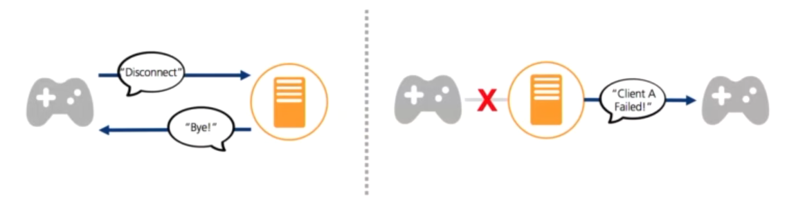
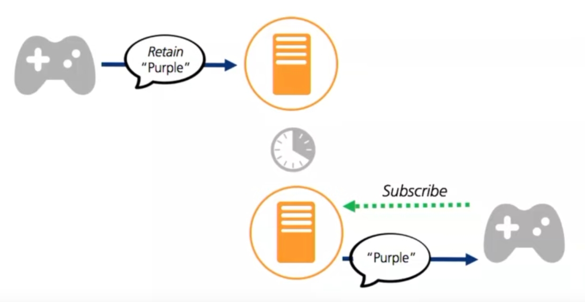

# IoT Communication Protocols

IoT devices typically connect to and exchange data with a single cloud IoT service over a specific communication protocol. That service in turn is connected to the rest of the IoT infrastructure.

> Data gathered from sensors and sent to the cloud is called **telemetry**.

We will look at common communication protocols used in IoT with a focus on MQTT.


## HTTP

So far in this course we've been exchanging data between our devices and the IoT cloud service **Adafruit IO** (AIO)

> The default client instantiated by the AIO python library is a thin HTTP wrapper around the REST-based API.


From the python [adafruit-io documentation](https://adafruit-io-python-client.readthedocs.io/en/latest/quickstart.html#basic-client-usage).

```python
# REST client using HTTP.
from Adafruit_IO import Client
aio = Client('YOUR ADAFRUIT USER', 'YOUR ADAFRUIT IO KEY')

aio.send('Foo', 100)

data = aio.receive('Foo')

print(f'Received value: {data.value}')
```


HTTP is a common protocol for the web, however, some of its characteristics make it not ideal for IoT applications.


> See Adafruit IO HTTP [API documentation](https://io.adafruit.com/api/docs/#adafruit-io-http-api).


### Typical HTTP request


<p class=img-info>
	<a href="https://cheapsslsecurity.com/p/http2-vs-http1/"> Example of an HTTP Request </a>&nbsp; cheapsslsecurity.com.
</p>

For example, below is the  HTTP request to post data to Adafruit IO (234 bytes long):

```http
POST /api/v2/mauedu/feeds/assign1-temp/data HTTP/2
Host: io.adafruit.com
user-agent: insomnia/2021.7.2
x-aio-key: aio_EDSv22qwj94EA8cNiceTry
content-type: application/x-www-form-urlencoded
accept: */*
content-length: 7

 value=24
```

### Typical HTTP Response


<p class=img-info>
	<a href="https://cheapsslsecurity.com/p/http2-vs-http1/"> Example of an HTTP Response </a>&nbsp; cheapsslsecurity.com.
</p>


Below is the HTTP response header for the posting of AIO data above (1 KB long)

```http
HTTP/2 200 
server: nginx
date: Wed, 02 Mar 2022 21:44:20 GMT
content-type: application/json; charset=utf-8
x-frame-options: SAMEORIGIN
x-xss-protection: 1; mode=block
x-content-type-options: nosniff
x-download-options: noopen
x-permitted-cross-domain-policies: none
referrer-policy: strict-origin-when-cross-origin
x-aio-worker: io-rails-2
access-control-allow-origin: *
access-control-allow-credentials: false
access-control-request-method: *
access-control-allow-methods: POST, PUT, DELETE, GET, OPTIONS, PATCH
access-control-allow-headers: DNT, Origin, X-Requested-With, X-AIO-Key, Content-Type, Accept, Authorization
access-control-expose-headers: X-Pagination-Limit, X-Pagination-Start, X-Pagination-End, X-Pagination-Count, X-Pagination-Total
access-control-max-age: 1728000
etag: W/"e063fe3ce3389f69ef8d253787"
cache-control: max-age=0, private, must-revalidate
x-request-id: e9c52e2e-6019-4af9-a0a7-nope
x-runtime: 0.033960
x-aio-proxy: 1
strict-transport-security: max-age=31536000
permissions-policy: interest-cohort=()
```

Plus the actual response body (190 bytes):

```json
{
	"id": "0EZ3YYJJZ4KWNF4G54438PZQK1",
	"value": "1",
	"feed_id": 1814812,
	"feed_key": "assign1-temp",
	"created_at": "2022-03-02T21:44:20Z",
	"created_epoch": 1646257460,
	"expiration": "2022-04-01T20:44:20Z"
}
```

### HTTP Characteristics

The following HTTP characteristics are relevant in the IoT context:

- **Request response protocol**: client always has to request an update from the server.
- Designed for **large bandwidth**, low delay.
- **Stateless**: each request is considered as the new request. Server doesn't recognise the user by default (cookies or tokens are required).
- **Resource identification**: each request includes a URI (universal resource identifier).
- **DNS lookup**: 3-way identification handshake (overhead).
- **Big protocol headers**: uncompressed content transfer that is not the payload.


In HTTP, the client has to be constantly "pulling" the server for new information. Pull updates are either slow (check only every few minutes) or data/power intensive (check constantly).


<p class=img-info>
	<a href="https://learn.adafruit.com/alltheiot-protocols?view=all#internet-of-toast-2977937-4"> HTTP Client constantly pulling the server for updates </a>&nbsp; HTTP Protocol, Adafruit.
</p>


## Pub/Sub Communication

> The most popular communication pattern for IoT systems is a publish/subscribe (pub/sub) messaging system done via some kind of broker.

This IoT system has two types of actors:

- One or more **Clients**
- One **Broker**


[](https://github.com/microsoft/IoT-For-Beginners/blob/main/images/pub-sub.png)
<p class=img-info>
	<a href="https://github.com/microsoft/IoT-For-Beginners/tree/main/1-getting-started/lessons/4-connect-internet"> Broker and client relationship  </a>&nbsp; IoT for Beginners, Microsoft.
</p>

### Clients

**Clients** are typically devices, applications or back-end services. They connect to the broker and publish telemetry as well as subscribe to commands.

> **A cloud service is an example of a client**.
> 
> It connects to the broker and subscribes to all the telemetry messages and publishes commands either to specific devices, or to groups of devices.


The client performs two operations:

- **Publishes information:** When the client sends the data to the server.
- **Subscribes to information:** When the client receives the data from the server.


### Broker
The Broker is typically running on a server and performs the following operations:

- Accepts messages from clients.
- Processes subscribe and unsubscribe requests.
- Forwards messages to specific clients according to subscription requests.


> MQTT is the most popular communication protocol for IoT devices


## MQTT

Message Queueing Telemetry Transport, [MQTT](http://mqtt.org), is a lightweight pub/sub protocol. It was originally designed to monitor oil pipelines where connectivity could not be guaranteed.

One or more clients connect to a single broker, who routes messages to the interested clients.

MQTT manages messages **asynchronously** over a **network socket**.

The broker can hold and forward messages from client to client so if one gets disconnected, it will be able to fetch the message when it reconnects later.

> [Facebook Messenger uses MQTT](https://engineering.fb.com/2011/08/12/android/building-facebook-messenger/) and is the World's largest MQTT network.
> 
> Infrastructure details [here](https://engineering.fb.com/2014/10/09/production-engineering/building-mobile-first-infrastructure-for-messenger/) (nice read!).


### Topics & Wildcards

Messages are routed using **named topics**, rather than being sent directly to an individual client. A client can publish to a topic, and any clients subscribed to that topic will receive the message.


In the example below, a **client device is publishing** some data (not shown) to the topic `/telemetry`. Immediately after the data is received by the broker, the **broker routes the message** to a client application previously **subscribed to the same topic**.


[](https://github.com/microsoft/IoT-For-Beginners/blob/main/images/mqtt.png)
<p class=img-info>
	<a href="https://github.com/microsoft/IoT-For-Beginners/tree/main/1-getting-started/lessons/4-connect-internet"> MQTT Topics  </a>&nbsp; IoT for Beginners, Microsoft.
</p>

> Topics **typically have a hierarchy** to keep data organized and intuitive to access.


For example, a factory might want to track temperature from different HVAC units on different floor.

The topic hierarchy could be set up in the following way:

`sensors/<FLOOR>/temperature/<HVAC_UNIT_ID>`

HVAC units would publish data to the following topics:

- The AC unit on the third floor: `sensors/floor3/temperature/AC1`
- The boiler unit on the tenth floor: `sensors/floor10/temperature/boiler`
- The heater unit on the fourth floor: `sensors/floor4/temperature/heater`


#### Wildcards

Clients can subscribe to different levels of the topic hierarchy using **wildcards**.

When subscribing to multiple topics two **wildcard** characters can be used:

-   **# (hash character)** – multi level wildcard
-   **+** **(plus character)** -single level wildcard


Using the previous factory temperature example, an application could monitor multiple temperatures in the following way:

| Topic string                   | Subscription result                                 |
| ------------------------------ | --------------------------------------------------- |
| `sensors/floor3/temperature/+` | **All** of the temperature sensors on the 3rd floor |
| `sensors/+/temperature/+`      | **All** the temperature data on **all** floors |
| `sensors/#`                    | **All** topics going on **all** floors |
| `sensors/floor10/#`            | **All** topics of the tenth floor |


### Messages

Like to HTTP, MQTT is built on top of TCP/IP and can also be used over websockets.

MQTT messages can be as short as 2 bytes (eg. acknowledgement or disconnect messages), as big as 256Mb (eg. publishing a picture or firmware update).

A typical telemetry message with payload data such as `value=40` to a topic `/assign1-temp` has a size around  20 to 40 bytes.

> Message headers and topic names are text encoded (UTF-8).
>
> Message payload encoding is specific to the application (eg. plain text, JSON, binary, etc)


MQTT connections can be **public and open, or encrypted and secured** using usernames and passwords, or certificates.


### QoS

Messages can be sent with a quality of service (QoS) flag, which determines the guarantee of the message being received.

- **QoS 0: At most once (Fire and Forget)** - the message is sent only once and the client and broker take no additional steps to acknowledge delivery (fire and forget).

- **QoS 1: At least once** - the message is re-tried by the sender multiple times until acknowledgement is received (acknowledged delivery).

- **QoS 2: Exactly once** - the sender and receiver engage in a two-level handshake to ensure only one copy of the message is received (assured delivery).

Below is an example of **QoS 1**:


<p class=img-info>
	<a href="https://learn.adafruit.com/alltheiot-protocols/mqtt-qos"> Example of 'At Least Once' (QoS 1) delivery </a>&nbsp; MQTT QoS, Adafruit.
</p>

> By default MQTT sessions are established with QoS 0 for all messages (clean sessions).
> 
> This means that if a client disconnects and then reconnects, **it won't receive messages sent during the disconnection**.


When setting QoS, there are two sides of message delivery:

1.  Message delivery form the publishing client to the broker.
2.  Message delivery from the broker to the subscribing client.

The client that publishes the message to the broker defines the QoS level of the message when it sends the message to the broker.

The broker transmits this message to subscribing clients **using the QoS level that each subscribing client defines** during the subscription process.

> If the subscribing client defines a lower QoS than the publishing client, the broker transmits the message with the lower quality of service.


### Sessions: Clean or Persistent

Typically, a client-broker connection is established with the session flag set to **Clean** with `CleanSession = true` (however, this is specific to the library implementation).

In this case the broker does not store anything for the client and purges all information from any previous subscriptions.

 In a persistent session (`CleanSession = false`), the broker stores all subscriptions for the client and all missed messages for the client **IF it subscribed with a QoS level 1 or 2**.


### KeepAlive

The keep alive flag is **a time interval in seconds** that the client specifies and communicates to the broker when the connection established.

This is longest period of time that the broker and client can go without **pinging each other**. This method allows both sides to determine if the session is still available.


### Last Will & Testament

When a client connects, it can provide the broker with a Last Will and Testament (LWT) message and topic.

If the client disconnects ungracefully, the broker sends the LWT message on behalf of the client.

**This message notifies other clients when a client disconnects unexpectedly.**



<p class=img-info>
	<a href="https://www.youtube.com/watch?v=LKz1jYngpcU"> Last Will & Testament  </a>&nbsp; Why HTTP isn't the King of the IoT, Robert Bird, Akamai.
</p>

### Retained Messages

A retained message is **a normal MQTT message with the retained flag set to true**.

The broker stores the last retained message and the corresponding QoS for that topic.

Each client that subscribes to a topic pattern that matches the topic of the retained message receives the retained message immediately after they subscribe.

The broker stores only one retained message per topic.

> Retained messages help newly-subscribed clients get a status update immediately after they subscribe to a topic.



<p class=img-info>
	<a href="https://www.youtube.com/watch?v=LKz1jYngpcU"> Message with Retained Flag </a>&nbsp; Why HTTP isn't the King of the IoT, Robert Bird, Akamai.
</p>

## HTTP vs MQTT

| Criteria                | MQTT                                                    | HTTP                                   |
| ----------------------- | ------------------------------------------------------- | -------------------------------------- |
| Complexity              | Simple and lightweight                                  | More complex and slightly heavier      |
| Consumption             | More energy efficient                                   | Less energy efficient                  |
| Communication direction | Bi-directional (client or broker can initiate)          | Uni-directional (client must initiate) |
| Architecture            | Publish / Subscribe model                               | Request / Response Model               |
| Session                 | Can keep connection open                                | Connection closes after every request  |
| Delivery assurance      | Reliable message delivery with QoS (Quality of Service) | No QoS option                          |
| Header size             | Smaller (~2 bytes)                                      | Comparatively large size (~8 bytes)    |


## MQTT Client Examples

Let's write a simple MQTT client that publishes and subscribes to messages.

Since a broker is necessary, we will use the publicly available MQTT broker from Eclipse Foundation, hosted at [test.mosquitto.org](https://test.mosquitto.org).

For the client implementation we will use the [Eclipse Paho MQTT Python Client](https://github.com/eclipse/paho.mqtt.python). It is a popular choice for many IoT Cloud services such as Adafruit IO.

Documentation for the `paho-mqtt` client is available at the [Pypi page](https://pypi.org/project/paho-mqtt/#constructor-reinitialise).

However, there are lots of other implementation options.

> This [link compiles a list](https://mqtt.org/software/) of open-source MQTT client and broker implementations you can use in your projects.


### Publishing only

The first example will only publish random data to the broker every 2 seconds.

1. Install the `paho-python` library.

```bash
pip install paho-python
```

2. Create your script file. A few notes:

- Create a unique client ID to avoid conflicts with other users (this is a public broker).
	- Use this [Online GUID generator](https://www.guidgen.com/) to generate a unique ID.
	
```python
key = 'd5a4d5e6-d597-4bd4-8196-5f51d12345'
```

- To have a unique client name and topic, we will combine the key from above with the desired name and topic.

```python
client_name = key + 'publisher'
topic_name = key + '/temperature'
```

- Import `paho-python` and the built-in `json` library (we'll encode our data as JSON).

```python
import paho.mqtt.client as mqtt
import json
```

- All network operations (incoming and outgoing data) are processed with the `loop()` method every 3 seconds

Complete code:

```python
# Blindly publish data topic

import paho.mqtt.client as mqtt
import json

import time
import random

rnd = random.Random()

key = 'd5a4d5e6-d597-4bd4-8196-5f51d12345'
topic_name = key + '/temperature'
client_name = key + 'publisher'

mqtt_client = mqtt.Client(client_name)
mqtt_client.connect('test.mosquitto.org')

print("MQTT connected!")

while True:

	# Random integer between -10 and 30
	temp = rnd.randint(-10, 30)
	
	# Prepare json payload
	payload = json.dumps({'temperature': temp})
	print("Sending telemetry ", payload)
	
	# Send it off. QoS=0 and Retain=false
	info = mqtt_client.publish(topic_name, payload)
	
	# Process network event. Handles incoming/outgoing data
	mqtt_client.loop()
	
	time.sleep(3)
```


### Subscribing only

The MQTT client below subscribes to data from the publisher using the **library's default values**.

A few notes:

- The subscriber used the same unique key as the publisher in order to subscribe to the same topics. However, the subscriber has its own client name.

```python
key = 'd5a4d5e6-d597-4bd4-8196-5f51d12345'
topic_name = key + '/temperature'
client_name = key + 'subscriber'
```

- Once the client receives a message from the broker, the method `on_message` is called. This is used as a hook to define our own callback function.

```python
# Callback for when a message is received
def message_received(mqtt_client, userdata, message):
print(f'Received message: {message.payload}')

# Callback hook
mqtt_client.on_message = message_received
```

- Similarly to the publisher example, the network loop is processed every 1 second.

The complete subscriber code:

```python
# Subscribe to a topic with library's default values.

import paho.mqtt.client as mqtt
import json

import time
import random

key = 'd5a4d5e6-d597-4bd4-8196-5f51d12345'
client_name = key + 'subscriber'
topic_name = key + '/temperature'

mqtt_client = mqtt.Client(client_name)
mqtt_client.connect('test.mosquitto.org')
print("MQTT connected!")


# Callback for when a message is received
def message_received(mqtt_client, userdata, message):
	print(f'Received message: {message.payload}')


# Callback hook
mqtt_client.on_message = message_received

mqtt_client.subscribe(topic_name)

while True:

	# Process network event. Handles incoming/outgoing data
	mqtt_client.loop()
	
	time.sleep(1)
```


## Connectivity Issues

Connectivity is not always guaranteed. Things to think about when coding your application:

**What happens if:**
- Connection is lost just prior to telemetry being published?
- Client connection is lost just prior to broker forwarding messages?

**How to make sure that:**
- The broker has received the most up to date telemetry data?
- Client has the most recent command/data?


## References & Resources

<iframe width="560" height="315" src="https://www.youtube.com/embed/shqLy8XjqAQ" title="YouTube video player" frameborder="0" allow="accelerometer; autoplay; clipboard-write; encrypted-media; gyroscope; picture-in-picture" allowfullscreen></iframe>

<iframe width="560" height="315" src="https://www.youtube.com/embed/LKz1jYngpcU" title="YouTube video player" frameborder="0" allow="accelerometer; autoplay; clipboard-write; encrypted-media; gyroscope; picture-in-picture" allowfullscreen></iframe>

[All the Internet of Things - Episode Two: Protocols](https://learn.adafruit.com/alltheiot-protocols?view=all#mqtt), by Adafruit and Digikey

[Lesson 4: connect your device to the Internet](https://github.com/microsoft/IoT-For-Beginners/tree/main/1-getting-started/lessons/4-connect-internet), IoT for Beginners by Microsoft

[MQTT Client and Broker and MQTT Server and Connection Establishment Explained](https://www.hivemq.com/blog/mqtt-essentials-part-3-client-broker-connection-establishment/) by HiveMQ

### Diving Deeper 

[MQTT Packet Format](https://openlabpro.com/guide/mqtt-packet-format/) by OpenLab

[Understanding the MQTT Protocol Packet Structure](http://www.steves-internet-guide.com/mqtt-protocol-messages-overview/) by steves-internet-guide.com