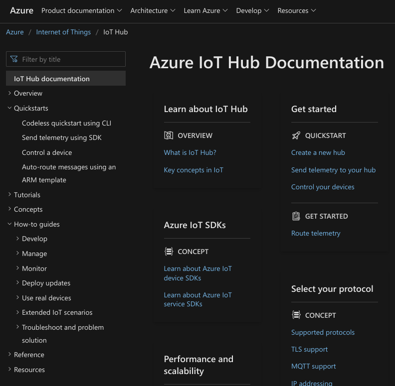
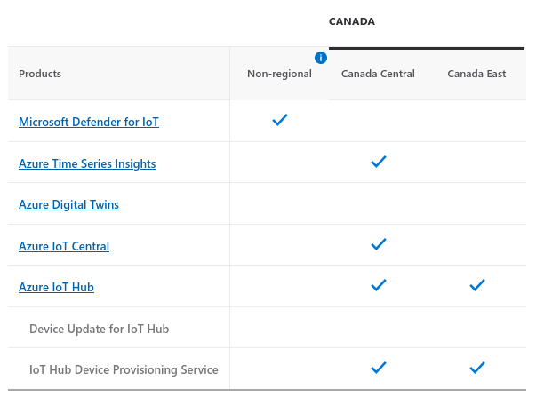

# Intro to Azure IoT
From now on, we will deploy and manage our IoT solutions using Microsoft Azure and it's Azure IoT platform as a service (PaaS).

## Platform as a Service (PaaS)

Platform as a service (PaaS) is a complete development and deployment environment in the cloud.

It includes infrastructure - servers, storage, and networking - but also includes middleware, development tools, business intelligence services (BI), database management systems, and more.

> PaaS is designed to support the complete web application lifecycle: building, testing, deploying, managing, and updating.

<a href="https://docs.microsoft.com/en-us/learn/modules/introduction-iot-solution-"> SaaS vs PaaS vs IaaS </a>&nbsp; What is PaaS?, Microsoft.

When we used Adafruit IO (AIO), we were using a complete software solution, in other words, we were using a software as a service (SaaS). 

We needed only to "plug" our device into the AIO service. We did not need to worry about data storage, application logic, authentication, etc.

> Moving forward, we will be implementing our IoT solutions using Microsoft Azure as PaaS.

See more in [What is PaaS](https://azure.microsoft.com/en-us/overview/what-is-paas/) by azure.microsoft.com

## IoT Architecture

In the first week of the course we looked at the high-level components of a IoT system:

1.  **Sensors:** enables the devices to collect data from the environment surrounding the device.
2.  **Connectivity:** assures the data collected is sent to the cloud.
3.  **Data Processing:** once the data is received by the cloud infrastructure, it can then be processed.
4.  **User Interface:** Once the data is processed, the results are then given to the end-user.

<a href="https://www.freecodecamp.org/news/introduction-to-iot-internet-of-things"> High-level components of an IoT System </a>&nbsp; by Pier Paolo Ippolito via freeCodeCamp.org.

We can further describe each one of these components as a **subsystems** and explore how information flows between them.

 

<a href="https://docs.microsoft.com/en-us/learn/modules/introduction-iot-solution-architecture/2-subsystems-iot-architecture"> Subsystems of IoT architecture </a>&nbsp; Examine systems of an IoT architecture, Microsoft.

**IoT Devices**: The physical devices where data originates.

**Cloud Gateway**: The Cloud Gateway provides a cloud hub for secure connectivity, telemetry, and event ingestion and device management (including command and control) capabilities.

**Stream Processing**: Processes large streams of data records, evaluates rules for those streams, and further routes the data.

**Storage**: Storage can be divided into warm path (data that is required to be available for reporting and visualization immediately from devices), and cold path (data that is stored longer term and used for batch processing).

**User Interface and Reporting**: The user interface for an IoT application can be delivered on a wide array of device types, in native applications, and browsers.

**Business Process Integration**: Facilitates executing actions based on insights garnered from device telemetry data during stream processing. Integration could include storage of informational messages, alarms, sending email or SMS, integration with CRM, and more.

> We will use Microsoft Azure to manage each sub-system individually.

## Azure Account
Students get $100 of credit for 12 months and free [developer tools](https://portal.azure.com/#blade/Microsoft_Azure_Billing/FreeServicesBlade) without a credit card. 

> **Create an account** and see details [here](https://azure.microsoft.com/en-us/free/students/).

The student account can be renewed annually (including $100 credits) for as long as you are a student.

Most things we'll do with Azure will use **free services**. We will occasionally use some of your free credits (~$20).

## IoT Hub & IoT Central

Microsoft Azure has two service offers for deploying and managing IoT systems: **IoT Hub** and **IoT Central**.

> The page [Overview: Connection options for Azure IoT device developers](https://docs.microsoft.com/en-us/azure/iot-develop/concepts-overview-connection-options#application-platforms-iot-central-and-iot-hub) offers a great summary and comparison between IoT Hub and IoT Central.

### IoT Central

Azure IoT Central is a software-as-a-service (SaaS) application that provides a complete platform for hosting IoT applications. It's main feature is a web UI that streamlines the lifecycle of creating and managing IoT applications.

The web UI simplifies the tasks of creating applications, and connecting and managing from a few up to millions of devices.

This service is has a limited free plan (2 devices with 5000 messages per month). Pricing available [here](https://azure.microsoft.com/en-us/pricing/details/iot-central/).

> We will revisit IoT Central later in the course.

See [official site for details](https://azure.microsoft.com/en-us/services/iot-central/#overview) or watch the [walk-through for an example](https://www.youtube.com/watch?v=G32stXSwtyA).

### IoT Hub
IoT Hub is a platform-as-a-service (PaaS) application that also provides a platform for hosting IoT applications. IoT Hub acts as a central message hub for bi-directional communication between IoT applications and connected devices.

IoT Hub offers **greater control and customization** over your application design, and **more developer tool options** for working with the service. However, it requires more development time and slightly more management complexity.

This service also offers a more generous free plan (500 devices with 8000 messages per day). 

See [official site for details](https://azure.microsoft.com/en-us/pricing/details/iot-hub/#overview) and [pricing](https://azure.microsoft.com/en-us/pricing/details/iot-hub/#pricing).

## IoT Hub Documentation

[**Azure IoT Hub Documentation**](https://docs.microsoft.com/en-us/azure/iot-hub/) hosts most of the documentation we will be using.

> Please get familiar with the left-hand menu, including the "Quickstarts" and "How-to guides"

## Azure Resource Group & Zones

A resource group is a container that holds related resources for an Azure solution (such as your IoT system).

The resource group can include all or a subset of the resources for the solution. You decide how to  allocate resources to resource groups based on what makes sense for your organization. Generally, group resources that share the same lifecycle (deploy, update, and delete).

> Azure resources and their groups must be deployed to a particular region.
> 
> **To create a resource group** see guide [Manage Azure resource groups by using the Azure portal](https://docs.microsoft.com/en-us/azure/azure-resource-manager/management/manage-resource-groups-portal)

### Azure Regions

Azure operates in multiple datacenters around the world. These datacenters are grouped in to **geographic regions**.

To see a list of all Azure regions see [azure geographies](https://azure.microsoft.com/en-us/global-infrastructure/geographies/#overview).

<a href="https://www.poppelgaard.com/citrix-xenapp-essentials-microsoft-azure/azure_datacenters"> Map of Azure Regions (2017) </a>&nbsp; Thomas Poppelgaard.

Canada has two Azure regions:

- **Canada Central:** located in Toronto (with 3 zones).
- **Canada East**: located in Quebec City (no zones).  

 

Some services are only available in certain regions.
For example, Azure IoT Central is not available in the *Canada East* region.

### Azure Zones

Azure **availability zones** are physically separate locations within each Azure region that are tolerant to local failures.

Tolerance to failures is achieved because of redundancy and logical isolation of Azure services. To ensure resiliency, a minimum of three separate availability zones are present in all availability zone-enabled regions.

<a href="https://docs.microsoft.com/en-us/azure/availability-zones/az-overview"> Azure region with 3 zones and one disaster recovery location. </a>&nbsp; Regions and availability zones, Mocrosoft.

## Azure IoT Tools

Azure offers several developer tools to connect to the IoT Hub platform, and to create and manage applications a
Many of these tools have **nearly the same functionality**. It comes down to developer preference and workflow.

| Tool                                                                                                             | Description                                                                                                | Documentation                                                                                                             |
| ---------------------------------------------------------------------------------------------------------------- | ---------------------------------------------------------------------------------------------------------- | ------------------------------------------------------------------------------------------------------------------------- |
| [Azure portal](https://docs.microsoft.com/en-us/azure/azure-portal/azure-portal-overview)                                                                                                     | Browser-based portal for IoT Hub and devices. Also works with other Azure resources including IoT Central. | [Create an IoT hub with Azure portal](https://docs.microsoft.com/en-us/azure/iot-hub/iot-hub-create-through-portal)       |
| [Azure CLI](https://docs.microsoft.com/en-us/cli/azure/)                                                                                                        | Command-line interface for creating and managing IoT applications.                                         | [Create an IoT hub with CLI](https://docs.microsoft.com/en-us/azure/iot-hub/iot-hub-create-using-cli)                     |
| [Azure IoT Tools for VS Code](https://marketplace.visualstudio.com/items?itemName=vsciot-vscode.azure-iot-tools) | VS Code extension for IoT Hub applications.                                                                | [Create an IoT hub with Tools for VS Code](https://docs.microsoft.com/en-us/azure/iot-hub/iot-hub-create-use-iot-toolkit) |
| Azure IoT Explorer                                                                                               | Connects to an existing IoT hub to manage devices. Cannot create IoT hubs. Often used with CLI or Portal.  | [Azure IoT Explorer](https://github.com/Azure/azure-iot-explorer#azure-iot-explorer-preview)                              |
| Azure PowerShell                                                                                                 | PowerShell interface for creating and managing IoT applications                                            | [Create an IoT hub with PowerShell](https://docs.microsoft.com/en-us/azure/iot-hub/iot-hub-create-using-powershell)       |

### Azure CLI & Cloud Shell

Azure CLI is a terminal tool to manage Azure services. It's offered as a Bash and PowerShell shells.

Azure CLI can be installed in your local machine or run from the browse. It is not recommended to use it on a Raspberry Pi (although theoretically possible).

> To use in your local machine, see [Install Azure CLI](https://docs.microsoft.com/en-us/cli/azure/install-azure-cli). 

#### Cloud Shell

Azure Cloud Shell is the ability to run the Azure CLI directly in the browser. 

> Cloud Shell can be started from anywhere in the Azure portal.

The first time you start the Azure Cloud Shell you will be asked to setup an account.

> To get started follow [Quickstart for Bash in Azure Cloud Shell](https://docs.microsoft.com/en-us/azure/cloud-shell/quickstart) 
> - Note that creating a resource group or a Linux VM is not necessary at this point.

## Demo: IoT Hub & Device telemetry data

In-class demo to illustrate the process of:

1. Creating an resource group
2. Creating an IoT Hub
3. Defining a new device
4. Use Azure CLI and Azure IoT Tools for VS Code to:
	- Simulate device data and send it to IoT Hub
	- Monitor data incoming data in IoT Hub

This demo is based on the following guides:
- [Quickstart: Send telemetry from a device to an IoT hub and monitor it with the Azure CLI](https://docs.microsoft.com/en-us/azure/iot-hub/quickstart-send-telemetry-cli)
- [Quickstart: Send telemetry from an IoT Plug and Play device to Azure IoT Hub](https://docs.microsoft.com/en-us/azure/iot-develop/quickstart-send-telemetry-iot-hub?toc=%2Fazure%2Fiot-hub%2Ftoc.json&bc=%2Fazure%2Fiot-hub%2Fbreadcrumb%2Ftoc.json&pivots=programming-language-python)
